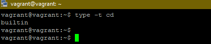
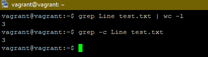
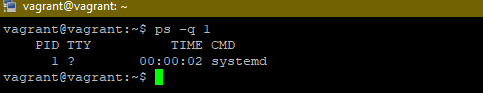
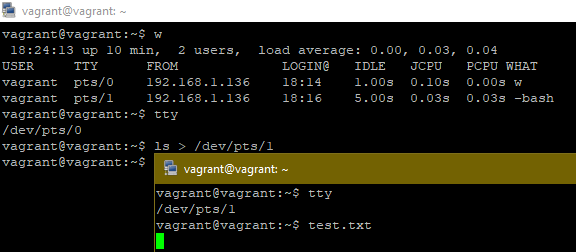
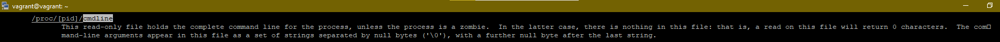
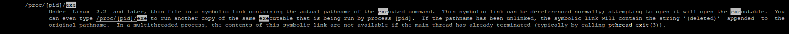
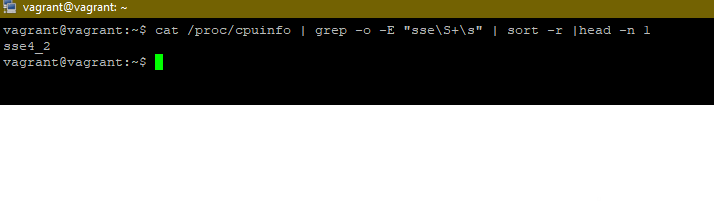

## Домашняя работа 
### 3.2. Работа в терминале, лекция 2

#### 1) Какого типа команда cd? Попробуйте объяснить, почему она именно такого типа; опишите ход своих мыслей, если считаете что она могла бы быть другого типа

> Команда имеет тип builtin 

Считаю что это правильное решение, потому что как правило встроенные в оболочку команды выполняются быстрее. Это очень удобно для часто используемых команд, которым как раз и относится `cd`

#### 2) Какая альтернатива без pipe команде grep <some_string> <some_file> | wc -l? man grep поможет в ответе на этот вопрос.

> grep -c <some_string> <some_file>

#### 3) Какой процесс с PID 1 является родителем для всех процессов в вашей виртуальной машине Ubuntu 20.04?

#### 4) Как будет выглядеть команда, которая перенаправит вывод stderr ls на другую сессию терминала?
+ Узнаем кто подключен к системе командой `w`
+ Узнаем свой номер `tty`
+ Перенаправими поток в другой терминал командой `ls > /dev/pts/#number pts`

#### 5) Получится ли одновременно передать команде файл на stdin и вывести ее stdout в другой файл? Приведите работающий пример

`cat < file1.txt > file2.txt`

#### 6) Получится ли вывести находясь в графическом режиме данные из PTY в какой-либо из эмуляторов TTY? Сможете ли вы наблюдать выводимые данные?

`cat /dev/tty > /dev/pts/#number pty`

#### 7) Выполните команду bash 5>&1. К чему она приведет? Что будет, если вы выполните echo netology > /proc/$$/fd/5? Почему так происходит?

+ `bash 5 > &1` Создает файловый дескриптор и передает его в поток выводв stdout
+ `echo netology > /proc/$$/fd/5` слово netology передается 5 дескриптору и выводится на экран т.к `>&1` => stdout (вывод на экран)

#### 8) Получится ли в качестве входного потока для pipe использовать только stderr команды, не потеряв при этом отображение stdout на pty? Напоминаем: по умолчанию через pipe передается только stdout команды слева от | на stdin команды справа. Это можно сделать, поменяв стандартные потоки местами через промежуточный новый дескриптор, который вы научились создавать в предыдущем вопросе.

#### 9) Что выведет команда cat /proc/$$/environ? Как еще можно получить аналогичный по содержанию вывод?

При помощи данной команды мы получим список переменных окружения. Аналог `printenv` и `env`

#### 10) Используя man, опишите что доступно по адресам /proc/<PID>/cmdline, /proc/<PID>/exe

Если в кратце: 
+ **cmdline** - содержит команду с помощью которой был запущен процесс, а также переданные ей параметры
+ **exe** - ссылка на исполняемый файл

#### 11) Узнайте, какую наиболее старшую версию набора инструкций SSE поддерживает ваш процессор с помощью /proc/cpuinfo

**Ответ:** sse4_2
**Команда** cat /proc/cpuinfo | grep -o -E "sse\S+\s" | sort -r |head -n 1

#### 12) При открытии нового окна терминала и vagrant ssh создается новая сессия и выделяется pty. Это можно подтвердить командой tty, которая упоминалась в лекции 3.2. Однако:

    vagrant@netology1:~$ ssh localhost 'tty'	
    not a tty

По умолчанию при выполнении команды по ssh не выделяется псевдо-терминал, для изменения такого поведения необходимо использовать опцию -t

#### 13) Бывает, что есть необходимость переместить запущенный процесс из одной сессии в другую. Попробуйте сделать это, воспользовавшись reptyr. Например, так можно перенести в screen процесс, который вы запустили по ошибке в обычной SSH-сессии

#### 14) sudo echo string > /root/new_file не даст выполнить перенаправление под обычным пользователем, так как перенаправлением занимается процесс shell'а, который запущен без sudo под вашим пользователем. Для решения данной проблемы можно использовать конструкцию echo string | sudo tee /root/new_file. Узнайте что делает команда tee и почему в отличие от sudo echo команда с sudo tee будет работать.

Команда `tee` направляет вывод как на `stdout`, так и в `файлы`, указаные в качестве параметров. `Sudo echo` не работает, потому что перенаправление выполняется оболочкой, а она запущена под обычными пользователем.

