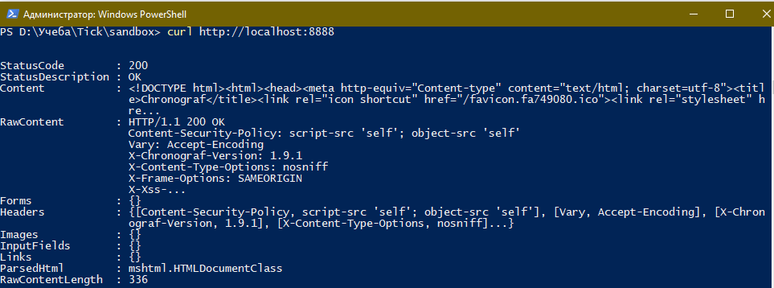
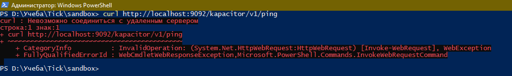

# Домашнее задание к занятию "10.02. Системы мониторинга"

## Обязательные задания

1. Опишите основные плюсы и минусы pull и push систем мониторинга.
___
*Ответ*

#### Push

| Плюсы 	| Минусы 	|
|:-----:	|:------:	|
| Сервер мониторинга не тратит ресурсы на опрос клиентов     	| Нужен агент мониторинга      	|
| Агент можно настроить на отправку метрик в несколько систем мониторинга     	| Настрйоки агента могут храниться локально, это небезопасно (т.к. там могут быть учетные данные для доступа к системам) и трудно отслеживать изменения конфигурации      	|
|     	| Система мониторинга должна быть в сетевой видимости агента      	|
|      	| Система мониторинга не отслеживает состояние агента, и нет понимания запущен он или нет      	|

#### Pull

| Плюсы 	| Минусы 	|
|:-----:	|:------:	|
| Возможен мониторинг систем и устройств без агента     	| Тратится много ресурсов на опрос клиентов (особенно если клиентов много)      	|
| Система мониторинга может быть в закрытой подсети и взаимодействие с агентами может вестись через прокси


2. Какие из ниже перечисленных систем относятся к push модели, а какие к pull? А может есть гибридные?

    - Prometheus
    - TICK
    - Zabbix
    - VictoriaMetrics
    - Nagios
___
*Ответ*

+ Prometheus => pull
+ TICK => push
+ Zabbix => pull/push
+ VictoriaMetrics => pull/push
+ Nagios => pull

3. Склонируйте себе [репозиторий](https://github.com/influxdata/sandbox/tree/master) и запустите TICK-стэк,
   используя технологии docker и docker-compose.

В виде решения на это упражнение приведите выводы команд с вашего компьютера (виртуальной машины):

    - curl http://localhost:8086/ping
    - curl http://localhost:8888
    - curl http://localhost:9092/kapacitor/v1/ping

А также скриншот веб-интерфейса ПО chronograf (`http://localhost:8888`).

P.S.: если при запуске некоторые контейнеры будут падать с ошибкой - проставьте им режим `Z`, например
`./data:/var/lib:Z`
___
*Ответ*
+ curl http://localhost:8086/ping
   
+ curl http://localhost:8888
  
+ curl http://localhost:9092/kapacitor/v1/ping
  
+ Веб скрин
  


4. Перейдите в веб-интерфейс Chronograf (`http://localhost:8888`) и откройте вкладку `Data explorer`.

    - Нажмите на кнопку `Add a query`
    - Изучите вывод интерфейса и выберите БД `telegraf.autogen`
    - В `measurments` выберите mem->host->telegraf_container_id , а в `fields` выберите used_percent.
      Внизу появится график утилизации оперативной памяти в контейнере telegraf.
    - Вверху вы можете увидеть запрос, аналогичный SQL-синтаксису.
      Поэкспериментируйте с запросом, попробуйте изменить группировку и интервал наблюдений.

Для выполнения задания приведите скриншот с отображением метрик утилизации места на диске
(disk->host->telegraf_container_id) из веб-интерфейса.
___
*Ответ*
Интерфейс Chronograf. Плагины для мониторинга памяти и диска  не были подключены. Добавил отдельно в конфигурации telegraf. Скриншот с утилизацией памяти и диска в процентах на рисунке ниже


5. Изучите список [telegraf inputs](https://github.com/influxdata/telegraf/tree/master/plugins/inputs).
   Добавьте в конфигурацию telegraf следующий плагин - [docker](https://github.com/influxdata/telegraf/tree/master/plugins/inputs/docker):
```
[[inputs.docker]]
  endpoint = "unix:///var/run/docker.sock"
```

Дополнительно вам может потребоваться донастройка контейнера telegraf в `docker-compose.yml` дополнительного volume и
режима privileged:
```
  telegraf:
    image: telegraf:1.4.0
    privileged: true
    volumes:
      - ./etc/telegraf.conf:/etc/telegraf/telegraf.conf:Z
      - /var/run/docker.sock:/var/run/docker.sock:Z
    links:
      - influxdb
    ports:
      - "8092:8092/udp"
      - "8094:8094"
      - "8125:8125/udp"
```

После настройке перезапустите telegraf, обновите веб интерфейс и приведите скриншотом список `measurments` в
веб-интерфейсе базы telegraf.autogen . Там должны появиться метрики, связанные с docker.

Факультативно можете изучить какие метрики собирает telegraf после выполнения данного задания.
___
*Ответ*

Плагин Docker для telegraf. Прописал настройки, перезапустил docker-compose. Данные плагина


