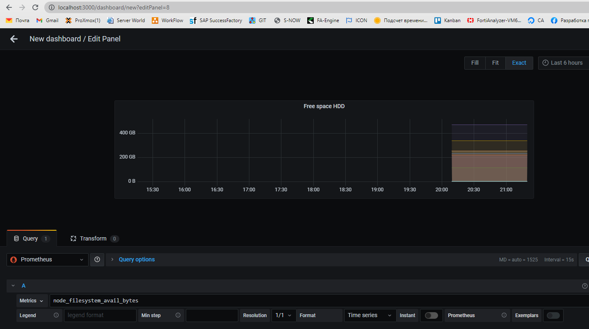
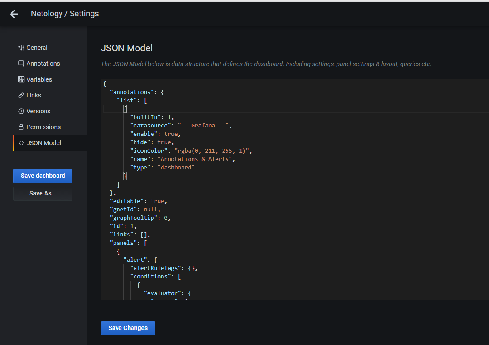

# Домашнее задание к занятию "10.03. Grafana"

___
## Обязательные задания

### Задание 1
Используя директорию [help](./help) внутри данного домашнего задания - запустите связку prometheus-grafana.

Зайдите в веб-интерфейс графана, используя авторизационные данные, указанные в манифесте docker-compose.

Подключите поднятый вами prometheus как источник данных.

Решение домашнего задания - скриншот веб-интерфейса grafana со списком подключенных Datasource.
___
**Ответ**

+ Настройки Datasource
  
+ Подключенный DataSource
  

## Задание 2
Изучите самостоятельно ресурсы:
- [promql-for-humans](https://timber.io/blog/promql-for-humans/#cpu-usage-by-instance)
- [understanding prometheus cpu metrics](https://www.robustperception.io/understanding-machine-cpu-usage)

Создайте Dashboard и в ней создайте следующие Panels:
- Утилизация CPU для nodeexporter (в процентах, 100-idle)
- CPULA 1/5/15
- Количество свободной оперативной памяти
- Количество места на файловой системе

Для решения данного ДЗ приведите promql запросы для выдачи этих метрик, а также скриншот получившейся Dashboard.
___
**Ответ**
- Утилизация CPU для nodeexporter (в процентах, 100-idle)
```python
avg (rate(node_cpu_seconds_total{instance="nodeexporter:9100", job="nodeexporter", mode="idle"}[10s]) * 100)
```
  

- CPULA 1/5/15
```python
node_load1{instance="nodeexporter:9100", job="nodeexporter"}

node_load15{instance="nodeexporter:9100", job="nodeexporter"}

node_load15{instance="nodeexporter:9100", job="nodeexporter"}
```


- Количество свободной оперативной памяти

```python
avg_over_time (node_memory_MemFree_bytes{instance="nodeexporter:9100", job="nodeexporter"}[5s])
```


- Количество места на файловой системе
```python
node_filesystem_avail_bytes
```



- готовый Dashboard


## Задание 3
Создайте для каждой Dashboard подходящее правило alert (можно обратиться к первой лекции в блоке "Мониторинг").

Для решения ДЗ - приведите скриншот вашей итоговой Dashboard.
___
**Ответ**

+ Создаем правило и настраиваем почту для уведомлений
  
+ Создаем правило при котором буде отправлено сообщение
  
+ Итоговый dashboard
  
 
## Задание 4
Сохраните ваш Dashboard.

Для этого перейдите в настройки Dashboard, выберите в боковом меню "JSON MODEL".

Далее скопируйте отображаемое json-содержимое в отдельный файл и сохраните его.

В решении задания - приведите листинг этого файла.
___
**Ответ**
+ Меню настроек, где можно сохранить `dashboard`

+ Листинг файла ниже
```json
{
  "annotations": {
    "list": [
      {
        "builtIn": 1,
        "datasource": "-- Grafana --",
        "enable": true,
        "hide": true,
        "iconColor": "rgba(0, 211, 255, 1)",
        "name": "Annotations & Alerts",
        "type": "dashboard"
      }
    ]
  },
  "editable": true,
  "gnetId": null,
  "graphTooltip": 0,
  "id": 1,
  "links": [],
  "panels": [
    {
      "alert": {
        "alertRuleTags": {},
        "conditions": [
          {
            "evaluator": {
              "params": [
                98
              ],
              "type": "gt"
            },
            "operator": {
              "type": "and"
            },
            "query": {
              "params": [
                "CPU",
                "5m",
                "now"
              ]
            },
            "reducer": {
              "params": [],
              "type": "avg"
            },
            "type": "query"
          }
        ],
        "executionErrorState": "alerting",
        "for": "5m",
        "frequency": "1m",
        "handler": 1,
        "message": "Warning!",
        "name": "CPU alert",
        "noDataState": "no_data",
        "notifications": []
      },
      "aliasColors": {},
      "bars": false,
      "dashLength": 10,
      "dashes": false,
      "datasource": null,
      "description": "",
      "fieldConfig": {
        "defaults": {
          "color": {},
          "custom": {},
          "thresholds": {
            "mode": "absolute",
            "steps": []
          },
          "unit": "short"
        },
        "overrides": []
      },
      "fill": 1,
      "fillGradient": 0,
      "gridPos": {
        "h": 9,
        "w": 7,
        "x": 0,
        "y": 0
      },
      "hiddenSeries": false,
      "id": 2,
      "legend": {
        "avg": false,
        "current": false,
        "max": false,
        "min": false,
        "show": true,
        "total": false,
        "values": false
      },
      "lines": true,
      "linewidth": 1,
      "nullPointMode": "null",
      "options": {
        "alertThreshold": true
      },
      "percentage": false,
      "pluginVersion": "7.4.0",
      "pointradius": 2,
      "points": false,
      "renderer": "flot",
      "seriesOverrides": [],
      "spaceLength": 10,
      "stack": false,
      "steppedLine": false,
      "targets": [
        {
          "exemplar": false,
          "expr": "avg (rate(node_cpu_seconds_total{instance=\"nodeexporter:9100\", job=\"nodeexporter\", mode=\"idle\"}[10s]) * 100)\r\n\r",
          "interval": "",
          "legendFormat": "CPU (idle)",
          "refId": "CPU"
        }
      ],
      "thresholds": [
        {
          "colorMode": "critical",
          "fill": true,
          "line": true,
          "op": "gt",
          "value": 98,
          "visible": true
        }
      ],
      "timeFrom": null,
      "timeRegions": [],
      "timeShift": null,
      "title": "CPU",
      "tooltip": {
        "shared": true,
        "sort": 0,
        "value_type": "individual"
      },
      "type": "graph",
      "xaxis": {
        "buckets": null,
        "mode": "time",
        "name": null,
        "show": true,
        "values": []
      },
      "yaxes": [
        {
          "format": "short",
          "label": null,
          "logBase": 1,
          "max": null,
          "min": null,
          "show": true
        },
        {
          "format": "short",
          "label": null,
          "logBase": 1,
          "max": null,
          "min": null,
          "show": true
        }
      ],
      "yaxis": {
        "align": false,
        "alignLevel": null
      }
    },
    {
      "datasource": null,
      "fieldConfig": {
        "defaults": {
          "color": {
            "mode": "palette-classic"
          },
          "custom": {
            "axisLabel": "",
            "axisPlacement": "auto",
            "barAlignment": 0,
            "drawStyle": "line",
            "fillOpacity": 10,
            "gradientMode": "none",
            "hideFrom": {
              "graph": false,
              "legend": false,
              "tooltip": false
            },
            "lineInterpolation": "linear",
            "lineWidth": 1,
            "pointSize": 5,
            "scaleDistribution": {
              "type": "linear"
            },
            "showPoints": "never",
            "spanNulls": true
          },
          "mappings": [],
          "thresholds": {
            "mode": "absolute",
            "steps": [
              {
                "color": "green",
                "value": null
              }
            ]
          },
          "unit": "short"
        },
        "overrides": []
      },
      "gridPos": {
        "h": 9,
        "w": 7,
        "x": 7,
        "y": 0
      },
      "id": 4,
      "options": {
        "graph": {},
        "legend": {
          "calcs": [],
          "displayMode": "list",
          "placement": "bottom"
        },
        "tooltipOptions": {
          "mode": "single"
        }
      },
      "pluginVersion": "7.4.0",
      "targets": [
        {
          "expr": "node_load1{instance=\"nodeexporter:9100\", job=\"nodeexporter\"}",
          "interval": "",
          "legendFormat": "1 min",
          "refId": "1"
        },
        {
          "expr": "node_load15{instance=\"nodeexporter:9100\", job=\"nodeexporter\"}",
          "hide": false,
          "interval": "",
          "legendFormat": "5 min",
          "refId": "5"
        },
        {
          "expr": "node_load15{instance=\"nodeexporter:9100\", job=\"nodeexporter\"}",
          "hide": false,
          "interval": "",
          "legendFormat": "15 min",
          "refId": "15"
        }
      ],
      "title": "CPULA 1/5/15",
      "type": "timeseries"
    },
    {
      "datasource": null,
      "fieldConfig": {
        "defaults": {
          "color": {
            "mode": "thresholds"
          },
          "custom": {},
          "mappings": [],
          "thresholds": {
            "mode": "absolute",
            "steps": [
              {
                "color": "green",
                "value": null
              },
              {
                "color": "dark-red",
                "value": 1
              },
              {
                "color": "green",
                "value": 2
              }
            ]
          },
          "unit": "bits"
        },
        "overrides": []
      },
      "gridPos": {
        "h": 4,
        "w": 4,
        "x": 14,
        "y": 0
      },
      "id": 6,
      "options": {
        "orientation": "auto",
        "reduceOptions": {
          "calcs": [
            "lastNotNull"
          ],
          "fields": "/^\\{instance=\"nodeexporter:9100\", job=\"nodeexporter\"\\}$/",
          "values": false
        },
        "showThresholdLabels": false,
        "showThresholdMarkers": true,
        "text": {}
      },
      "pluginVersion": "7.4.0",
      "targets": [
        {
          "expr": "avg_over_time (node_memory_MemFree_bytes{instance=\"nodeexporter:9100\", job=\"nodeexporter\"}[5s])\r\n\r\n\r",
          "interval": "",
          "legendFormat": "",
          "refId": "A"
        }
      ],
      "timeFrom": null,
      "timeShift": null,
      "title": "RAM",
      "type": "gauge"
    },
    {
      "datasource": null,
      "fieldConfig": {
        "defaults": {
          "color": {
            "mode": "palette-classic"
          },
          "custom": {
            "axisLabel": "",
            "axisPlacement": "auto",
            "barAlignment": 0,
            "drawStyle": "line",
            "fillOpacity": 10,
            "gradientMode": "none",
            "hideFrom": {
              "graph": false,
              "legend": false,
              "tooltip": false
            },
            "lineInterpolation": "linear",
            "lineWidth": 1,
            "pointSize": 5,
            "scaleDistribution": {
              "type": "linear"
            },
            "showPoints": "never",
            "spanNulls": true
          },
          "mappings": [],
          "thresholds": {
            "mode": "absolute",
            "steps": []
          },
          "unit": "decbytes"
        },
        "overrides": []
      },
      "gridPos": {
        "h": 5,
        "w": 4,
        "x": 14,
        "y": 4
      },
      "id": 8,
      "options": {
        "graph": {},
        "legend": {
          "calcs": [],
          "displayMode": "hidden",
          "placement": "bottom"
        },
        "tooltipOptions": {
          "mode": "multi"
        }
      },
      "pluginVersion": "7.4.0",
      "targets": [
        {
          "expr": "node_filesystem_avail_bytes\r\n\r\n\r\n\r\n\r",
          "interval": "",
          "intervalFactor": 1,
          "legendFormat": "",
          "refId": "A"
        }
      ],
      "timeFrom": null,
      "timeShift": null,
      "title": "Free space HDD",
      "type": "timeseries"
    }
  ],
  "refresh": false,
  "schemaVersion": 27,
  "style": "dark",
  "tags": [],
  "templating": {
    "list": []
  },
  "time": {
    "from": "2022-02-10T16:10:17.869Z",
    "to": "2022-02-10T16:14:52.320Z"
  },
  "timepicker": {},
  "timezone": "",
  "title": "Netology",
  "uid": "M7YjiLa7z",
  "version": 2
}
```
