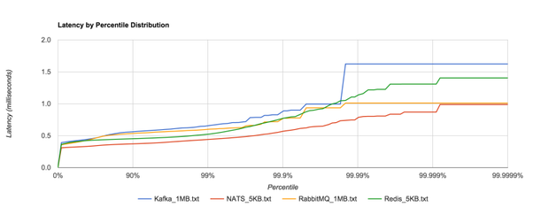

# Домашнее задание к занятию "11.02 Микросервисы: принципы"

Вы работаете в крупной компанию, которая строит систему на основе микросервисной архитектуры.
Вам как DevOps специалисту необходимо выдвинуть предложение по организации инфраструктуры, для разработки и эксплуатации.

## Задача 1: API Gateway

Предложите решение для обеспечения реализации API Gateway. Составьте сравнительную таблицу возможностей различных программных решений. На основе таблицы сделайте выбор решения.

Решение должно соответствовать следующим требованиям:
- Маршрутизация запросов к нужному сервису на основе конфигурации
- Возможность проверки аутентификационной информации в запросах
- Обеспечение терминации HTTPS

Обоснуйте свой выбор.
___
*Ответ*

|Наименование|Маршрутизация запросов на основе конфигурации|Аутентификация|HTTPS|Комментарий|
  | --- |:---:|:---:|:---:|:--- |
|Nginx|V|V|V|On Premise, подойдет для небольших инсталляций, функционал балансировки без подписки на Nginx Plus слабый, управление конфигами через ручные правки, C++|
|Kong|V|V|V|On Premise, Open source, на базе Nginx, Kubernetes Ingress Controller, конфигурация статическая или через API,WEB интерфейс управления, Lua|
|Tyk.io|V|V|V|On Premise и SaaS, Open source, есть бесплатная версия, Kubernetes Ingress Controller, WEB интерфейс управления, GoLang|

**Мой выбор**

Под указанные требования подходят многие платные и бесплатные сервисы. Как наиболее популярный и надежный инструмент (плюс бесплатный), документация, давно на рынке, предлагаю использовать `nginx`
___
## Задача 2: Брокер сообщений

Составьте таблицу возможностей различных брокеров сообщений. На основе таблицы сделайте обоснованный выбор решения.

Решение должно соответствовать следующим требованиям:
- Поддержка кластеризации для обеспечения надежности
- Хранение сообщений на диске в процессе доставки
- Высокая скорость работы
- Поддержка различных форматов сообщений
- Разделение прав доступа к различным потокам сообщений
- Простота эксплуатации

Обоснуйте свой выбор.
___
*Ответ*

|Название|Кластеризация|Хранение на диске|Высокая скорость|Различные форматы|Распределение прав|Простота|Комментарий|
| --- |:---:|:---:|:---:|:---:|:---:|:---:| --- |
|NATS|V|V|V|V|V|V|On Premise, Open source|
|RabbitMQ|V|V|V|V|V|V|On Premise, Open source|
|Kafka|V|V|V|V|V|V|On Premise, Open source|
|Redis|V|-|V|V|-|V|On Premise, Open source, можно хранить бэкапы в виде дампов|

**Мой выбор**
К сожалению ни когда не работал с этими инструментами, но при изучении этого вопроса, мой выбор упал на использование `NATS`.

Сравнительная таблица

Статья сравнений, где рекомендуют использовать данный инструмент с описанием всех преимуществ

[HABR](https://habr.com/ru/post/326880/)