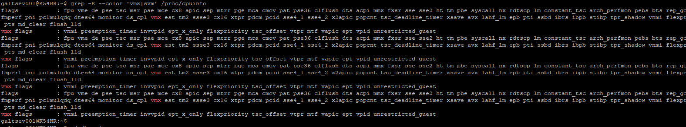
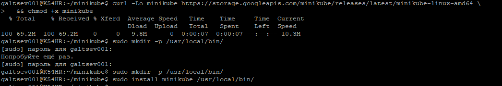
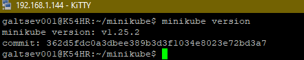
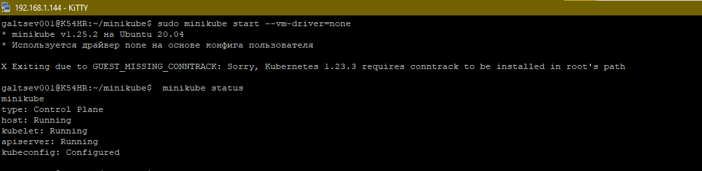
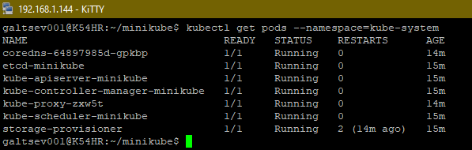
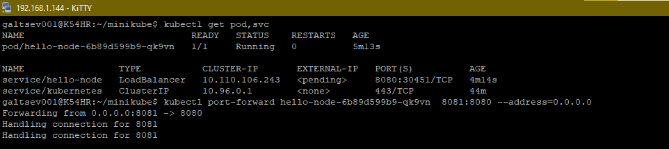
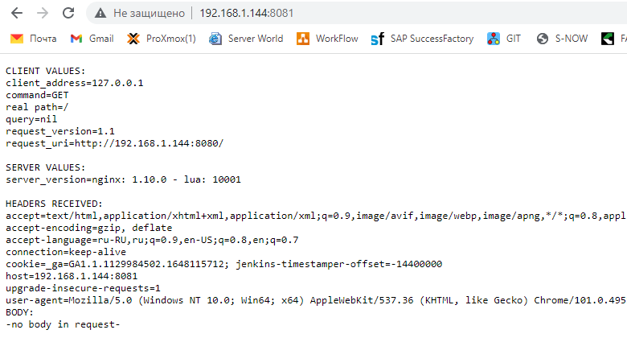
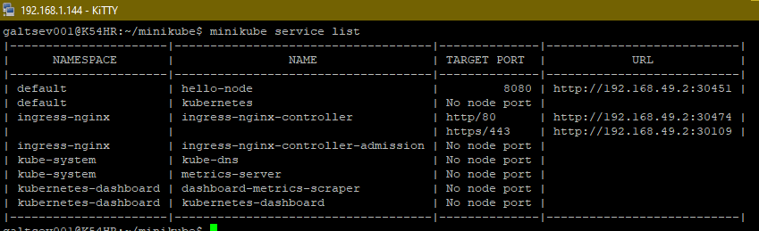
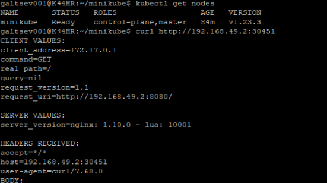

## 12.1 Компоненты Kubernetes

___
#### Задача 1: Установить Minikube

Для экспериментов и валидации ваших решений вам нужно подготовить тестовую среду для работы с Kubernetes. Оптимальное решение — развернуть на рабочей машине Minikube.

**Ответ**

+ Проверяем нашу станцию на наличие включенной функции виртуализации

+ Убедившись что все хорошо, устанавливаем `minikube`

+ Проверим что компонент установился - узнаем его версию

+ Команды `minikube start --vm-driver=none` и `minikube status`

+ Команда `kubectl get pods --namespace=kube-system`

___
#### Задача 2: Запуск Hello World

После установки Minikube требуется его проверить. Для этого подойдет стандартное приложение hello world. А для доступа к нему потребуется ingress.

развернуть через Minikube тестовое приложение по туториалу
установить аддоны ingress и dashboard

**Ответ**

+ Подготавливаем файлик `server.js` и `Dockerfile` из инструкции. По щагово выполняем команды, в конце проверяем наше приложение

+ Смотрим полученный результат в браузере

+ установить аддоны ingress и dashboard

___
#### Задача 3: Установить kubectl

Подготовить рабочую машину для управления корпоративным кластером. Установить клиентское приложение kubectl.

подключиться к minikube
проверить работу приложения из задания 2, запустив port-forward до кластера

**Ответ**

+ Установку сделал, согласно официальной инструкции, ниже результат работы

