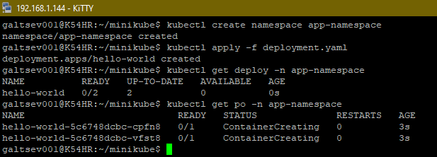
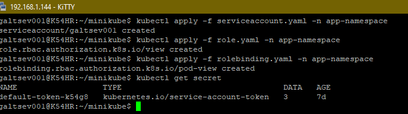
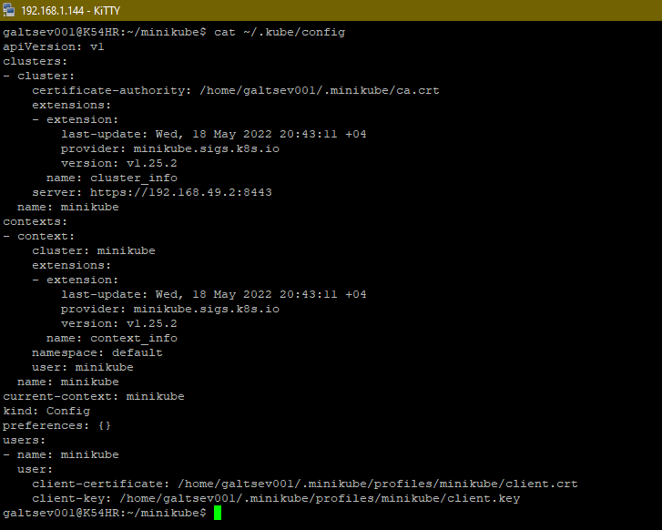
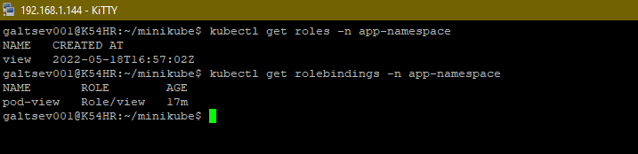
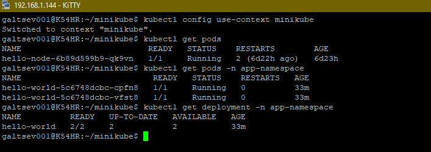
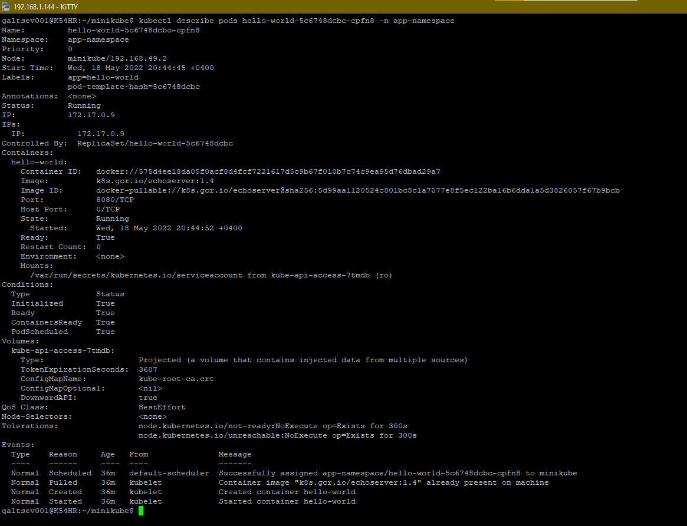
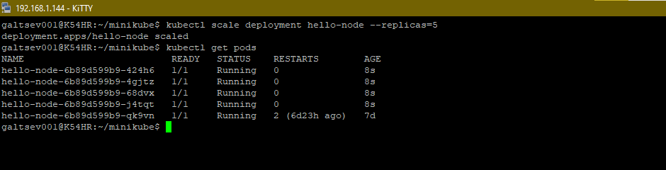

## 12.2 Команды для работы с Kubernetes

___
#### Задание 1: Запуск пода из образа в деплойменте
Для начала следует разобраться с прямым запуском приложений из консоли. Такой подход поможет быстро развернуть инструменты отладки в кластере. Требуется запустить деплоймент на основе образа из hello world уже через deployment. Сразу стоит запустить 2 копии приложения (replicas=2).

Требования:

пример из hello world запущен в качестве deployment
количество реплик в deployment установлено в 2
наличие deployment можно проверить командой kubectl get deployment
наличие подов можно проверить командой kubectl get pods

**Ответ**

+ Создадим файл `deployment.yaml`

[deployment.yaml](./file/deployment.yaml)

+ Необходимые команды для выполнения задания:
```bash
kubectl create namespace app-namespace
kubectl apply -f deployment.yaml
kubectl get deploy -n app-namespace
kubectl get po -n app-namespace
```
+ результат выполнения в консоле:



___
#### Задание 2: Просмотр логов для разработки
Разработчикам крайне важно получать обратную связь от штатно работающего приложения и, еще важнее, об ошибках в его работе. Требуется создать пользователя и выдать ему доступ на чтение конфигурации и логов подов в app-namespace.

Требования:

создан новый токен доступа для пользователя
пользователь прописан в локальный конфиг (~/.kube/config, блок users)
пользователь может просматривать логи подов и их конфигурацию (kubectl logs pod <pod_id>, kubectl describe pod <pod_id>)

**Ответ**

+ Создаем необходимые конфиг-файлы
  + [role.yaml](./file/role.yaml)
  + [rolebinding.yaml.yaml](./file/rolebinding.yaml)
  + [serviceaccount.yaml](./file/serviceaccount.yaml)

+ Создадим объекты на основании этих файлов



+ Смотрим локальный файл, проверяем запись о пользователе



+ Проверим 



+ Проверим доступ





___
#### Задание 3: Изменение количества реплик
Поработав с приложением, вы получили запрос на увеличение количества реплик приложения для нагрузки. Необходимо изменить запущенный deployment, увеличив количество реплик до 5. Посмотрите статус запущенных подов после увеличения реплик.

Требования:

в deployment из задания 1 изменено количество реплик на 5
проверить что все поды перешли в статус running (kubectl get pods)

**Ответ**

+ Используем команду `kubectl scale deployment hello-node --replicas=5`

+ Результат



+ Еще один вариант, это изменение файла [deployment.yaml](./file/deployment.yaml)

```shell
spec:
  replicas: 5
  selector:
```
+ Потом применить эти изменения с помощью команды `kubectl apply -f deployment.yaml`
___