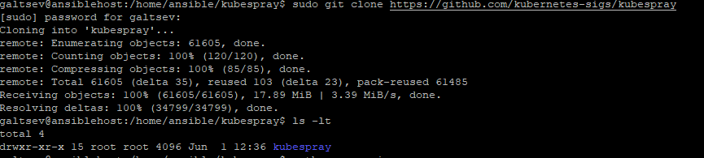
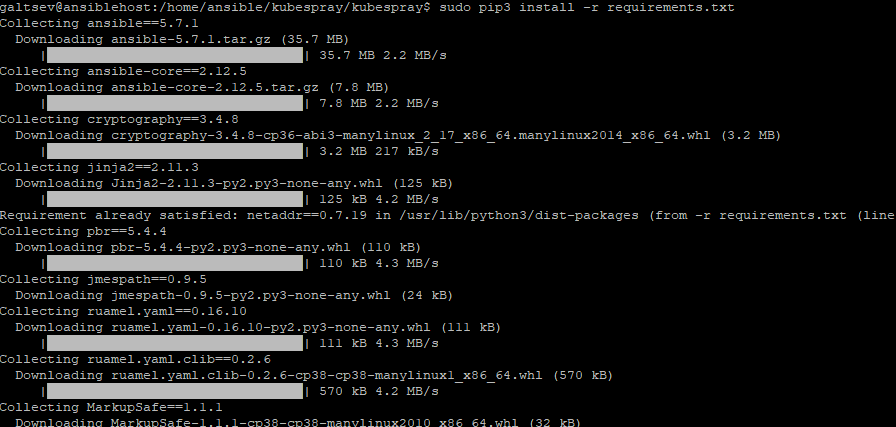
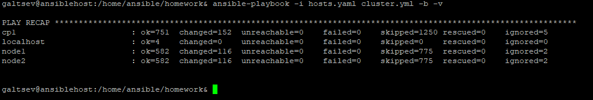
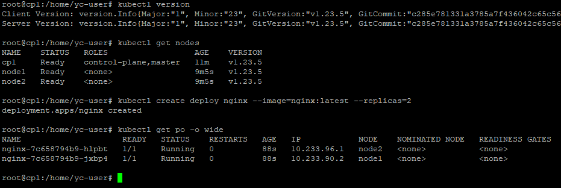

## 12.4 Развертывание кластера на собственных серверах, лекция 2
___
Новые проекты пошли стабильным потоком. Каждый проект требует себе несколько кластеров: под тесты и продуктив. Делать все руками — не вариант, поэтому стоит автоматизировать подготовку новых кластеров.

#### Задание 1: Подготовить инвентарь kubespray
Новые тестовые кластеры требуют типичных простых настроек. Нужно подготовить инвентарь и проверить его работу. Требования к инвентарю:
+ подготовка работы кластера из 5 нод: 1 мастер и 4 рабочие ноды;
+ в качестве CRI — containerd;
+ запуск etcd производить на мастере.

**Ответ:**

+ Клонируем с github `kubespray`



+ устанавливаем зависимости



+ Копируем пример плайбука и создаем `inventory` файл

```shell
cp -rfp inventory/sample /home/ansible/homework/
```

+ Мой `inventory` файл, полученный путем запуска билдера

```shell
declare -a IPS=(192.168.1.114 192.168.1.115 192.168.1.116)
CONFIG_FILE=/home/ansible/homework/hosts.yaml python3 contrib/inventory_builder/inventory.py ${IPS[@]}
```
+ `inventory` файл

```yaml
all:
  hosts:
    cp1:
      ansible_host: 192.168.1.114
      ansible_user: yc-user
    node1:
      ansible_host: 192.168.1.115
      ansible_user: yc-user
    node2:
      ansible_host: 192.168.1.116
      ansible_user: yc-user
  children:
    kube_control_plane:
      hosts:
        cp1:
    kube_node:
      hosts:
        cp1:
        node1:
        node2:
    etcd:
      hosts:
        cp1:
    k8s_cluster:
      children:
        kube_control_plane:
        kube_node:
    calico_rr:
      hosts: {}
```

+ в качестве CRI — containerd. У меня по умолчанию в файле `k8s-cluster.yml` уже стояла такая настройка

```yaml
## Container runtime
## docker for docker, crio for cri-o and containerd for containerd.
## Default: containerd
container_manager: containerd
```

+ Установка из [мануала](https://github.com/aak74/kubernetes-for-beginners/tree/master/15-install/30-kubespray). Далее проверка работы

`Установка`



`Проверка`



 ___
