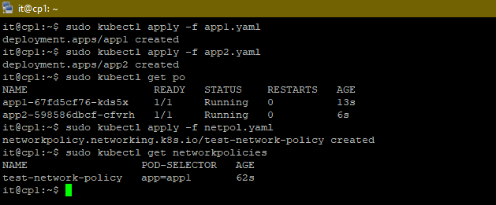
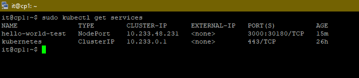
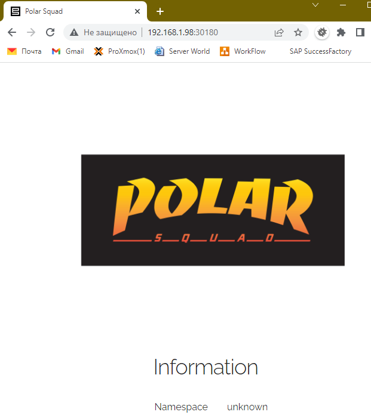
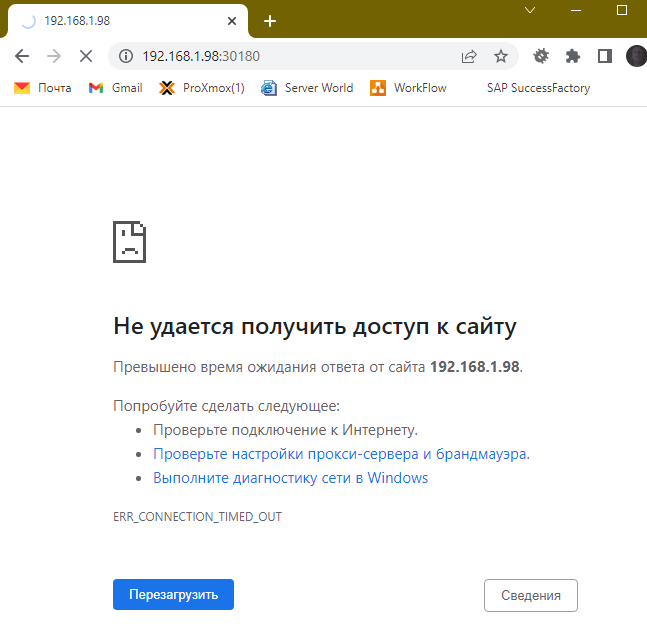
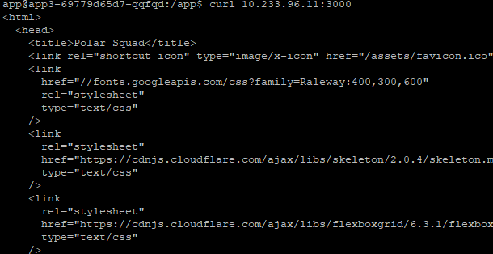
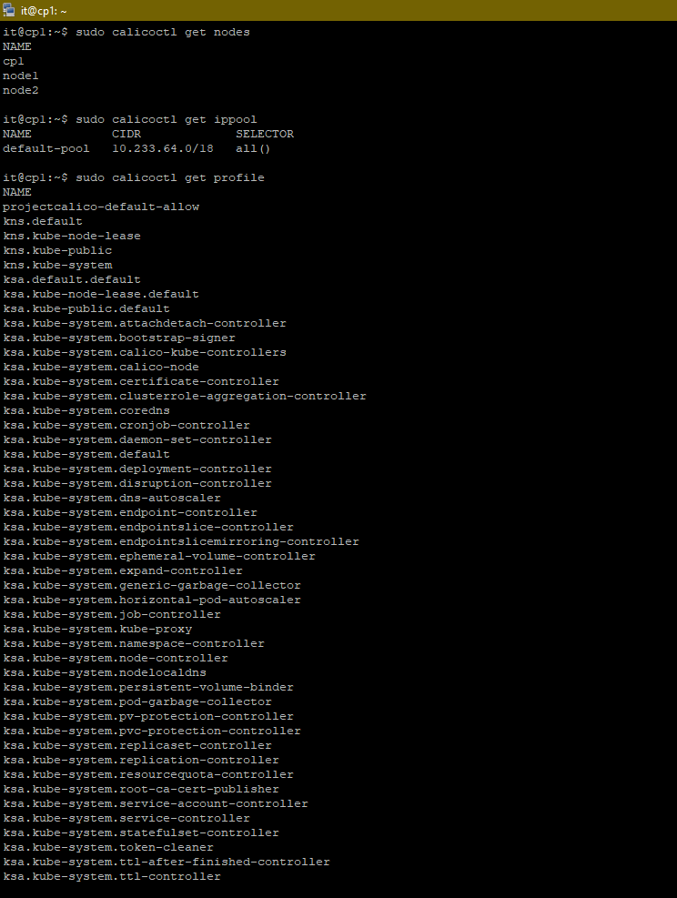

## 12.5 Сетевые решения CNI

После работы с Flannel появилась необходимость обеспечить безопасность для приложения. Для этого лучше всего подойдет Calico.

---
#### Задание 1: установить в кластер CNI плагин Calico
Для проверки других сетевых решений стоит поставить отличный от Flannel плагин — например, Calico. Требования:

+ установка производится через ansible/kubespray;
+ после применения следует настроить политику доступа к hello-world извне. Инструкции kubernetes.io, Calico
___
**Ответ:**

+ `Calico` при установке `kubernets` через `kuberspray` уже присутствовал в конфигурационном файле

```yaml
all:
  hosts:
    cp1:
      ansible_host: 192.168.1.126
      ansible_user: it
    node1:
      ansible_host: 192.168.1.98
      ansible_user: it
    node2:
      ansible_host: 192.168.1.53
      ansible_user: it
  children:
    kube_control_plane:
      hosts:
        cp1:
    kube_node:
      hosts:
        cp1:
        node1:
        node2:
    etcd:
      hosts:
        cp1:
    k8s_cluster:
      children:
        kube_control_plane:
        kube_node:
    *calico_rr:*
      hosts: {}
```
+ Для практической работы были созданы 3 пода [config](./config) + конфиг файл с политикой подключения. В нем описано, что под `app1` закрываем любой трафик, а `app2` делаем доступный для всех подов по порту 3000



+ Результат работы внутри пода app3 доступности app2 по 3000 порту

#### ДОРАБОТКА 

+ Созданная политика запрещает внешний трафик до `app1`, при этом доступ внутри подов остается до данного ресурса.
+ Чтобы проверить работу политики, для начала удалим ее

```yaml
 sudo kubectl delete  networkpolicy test-network-policy
```
+ Далее создадим `service` ля доступа из вне до `app1` для этого применим `new_policy.yaml`

```yaml
nano new_policy.yaml
______________________________
apiVersion: v1
kind: Service
metadata:
  name: hello-world-test
  labels:
    app: app1
spec:
  ports:
    - protocol: TCP
      port: 3000
      targetPort: 3000
  selector:
    app: app1
  type: NodePort
______________________________

sudo kubectl create -f new_policy.yaml
```

+ Проверим созданный сервис и его доступность



+ Доступ через браузер из вне



+ Применим политику и еще раз проверим доступ [netpolll.yaml](./config/netpool.yaml)

```bash
sudo kubectl create -f netpool.yaml
```

+ Через браузер



+ Внутри соседних подов


___
#### Задание 2: изучить, что запущено по умолчанию
Самый простой способ — проверить командой calicoctl get . Для проверки стоит получить список нод, ipPool и profile. Требования:

+ установить утилиту calicoctl;
+ получить 3 вышеописанных типа в консоли.
___
**Ответ:**

+ `calicoctl` была установлена по умолчанию, ниже скрин с выводом общей информации



___