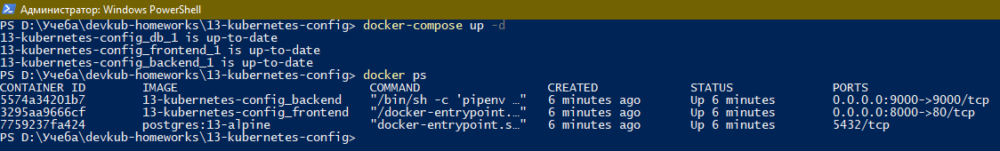
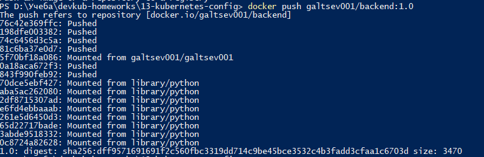
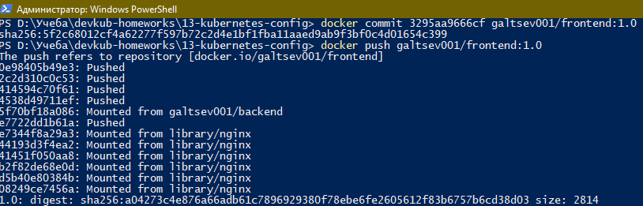
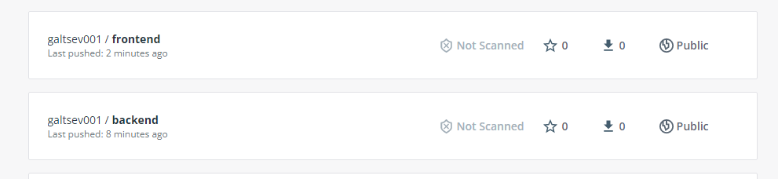
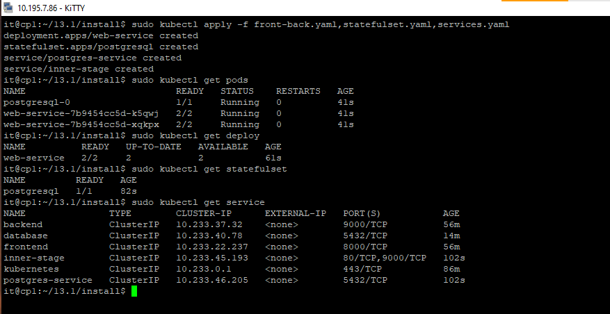

## 13.1 контейнеры, поды, deployment, statefulset, services, endpoints

---
#### Задание 1: подготовить тестовый конфиг для запуска приложения
Для начала следует подготовить запуск приложения в stage окружении с простыми настройками. Требования:

+ под содержит в себе 2 контейнера — фронтенд, бекенд;
+ регулируется с помощью deployment фронтенд и бекенд;
+ база данных — через statefulset.

---
**Ответ**

+ Проверяем полученный из задания `docker-compose` для запуска примера

+ Убедившись что с образом все в порядке, коммитем front и back сборки (образ базы данных берется из официальных источников) и пушим в docker hub

+ Проверяем на Docker Hub

+ После создаем 3 файла для выполнения задания [STAGE](./config/Stage/)

+ Запускаем установку и проверяем что получилось 

---

#### Задание 2: подготовить конфиг для production окружения
Следующим шагом будет запуск приложения в production окружении. Требования сложнее:

+ каждый компонент (база, бекенд, фронтенд) запускаются в своем поде, регулируются отдельными deployment’ами;
+ для связи используются service (у каждого компонента свой);
+ в окружении фронта прописан адрес сервиса бекенда;
+ в окружении бекенда прописан адрес сервиса базы данных.
---
**Ответ**

