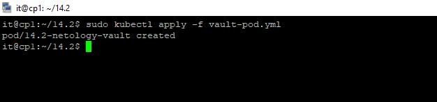
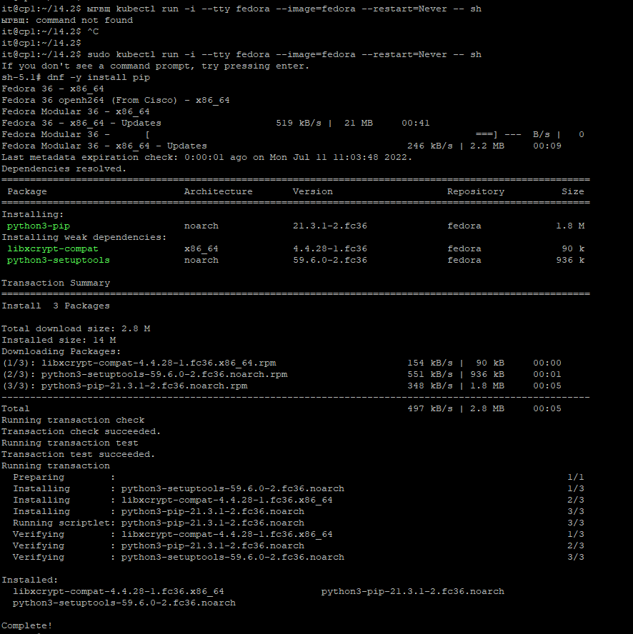
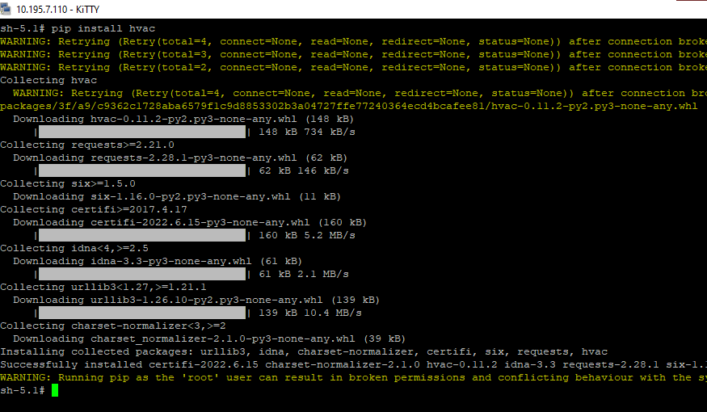
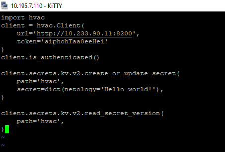

## 14.2 Синхронизация секретов с внешними сервисами. Vault

---
#### Задача 1: Работа с модулем Vault

Запустить модуль Vault конфигураций через утилиту kubectl в установленном minikube

Получить значение внутреннего IP пода

Примечание: jq - утилита для работы с JSON в командной строке

Запустить второй модуль для использования в качестве клиента

Установить дополнительные пакеты

Запустить интепретатор Python и выполнить следующий код, предварительно поменяв IP и токен

