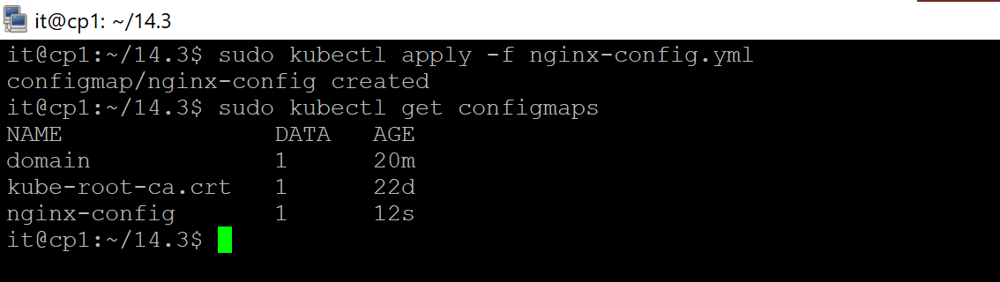

## 14.3 Карты конфигураци

#### Задача 1: Работа с картами конфигураций через утилиту kubectl в установленном minikube
___
Выполните приведённые команды в консоли. Получите вывод команд. Сохраните задачу 1 как справочный материал.

+ для начала практики скопируем необходимые файлы в папке 14.3


+ *Как создать карту конфигураций?*


```bash
kubectl create configmap nginx-config --from-file=nginx.conf
kubectl create configmap domain --from-literal=name=netology.ru
```

+ *Как просмотреть список карт конфигураций?*


```bash
kubectl get configmaps
kubectl get configmap
```

+ *Как просмотреть карту конфигурации?*


```bash
kubectl get configmap nginx-config
kubectl describe configmap domain
```

+ *Как получить информацию в формате YAML и/или JSON?*


```bash
kubectl get configmap nginx-config -o yaml
kubectl get configmap domain -o json
```

+ *Как выгрузить карту конфигурации и сохранить его в файл?*


```bash
kubectl get configmaps -o json > configmaps.json
kubectl get configmap nginx-config -o yaml > nginx-config.yml
```

+ *Как удалить карту конфигурации?*


```bash
kubectl delete configmap nginx-config
```

+ *Как загрузить карту конфигурации из файла?*



```bash
kubectl apply -f nginx-config.yml
```

___


