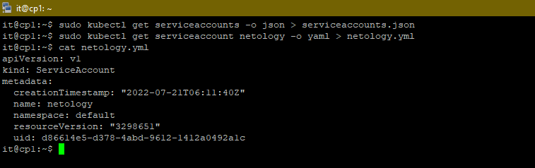

## 14.4 Сервис-аккаунты
___
#### Задача 1: Работа с сервис-аккаунтами через утилиту kubectl в установленном minikube
Выполните приведённые команды в консоли. Получите вывод команд. Сохраните задачу 1 как справочный материал.

+ *Как создать сервис-аккаунт?*


```bash
kubectl create serviceaccount netology
```
+ *Как просмотреть список сервис-акаунтов?*


```bash
kubectl get serviceaccounts
kubectl get serviceaccount
```
+ *Как получить информацию в формате YAML и/или JSON?*


```bash
kubectl get serviceaccount netology -o yaml
kubectl get serviceaccount default -o json
```

+ *Как выгрузить сервис-акаунты и сохранить его в файл?*



```bash
kubectl get serviceaccounts -o json > serviceaccounts.json
kubectl get serviceaccount netology -o yaml > netology.yml
```

+ *Как удалить сервис-акаунт?*


```bash
kubectl delete serviceaccount netology
```
+ *Как загрузить сервис-акаунт из файла?*


```bash
kubectl apply -f netology.yml
```