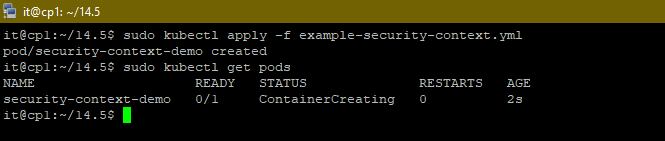
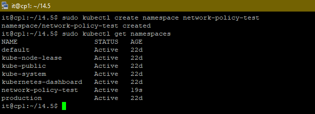
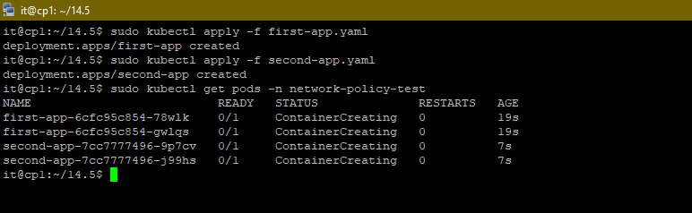
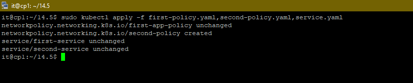
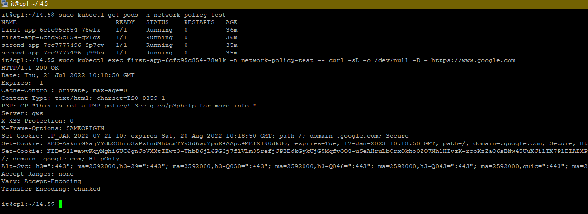
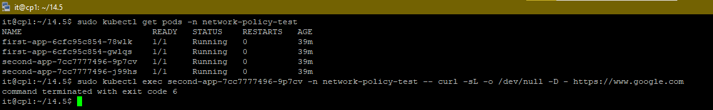
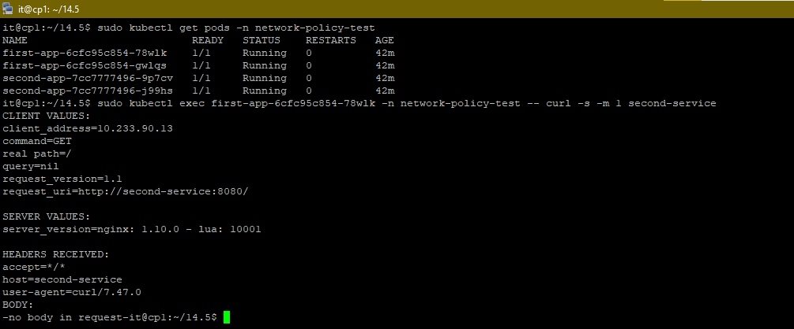
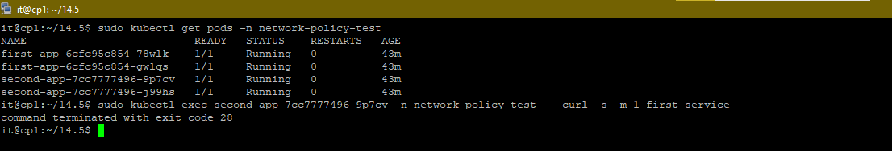

## 14.5 SecurityContext, NetworkPolicies
___
#### Задача 1: Рассмотрите пример 14.5/example-security-context.yml

+ Создайте модуль



```shell
kubectl apply -f 14.5/example-security-context.yml
```
+ Проверьте установленные настройки внутри контейнера


```shell
kubectl logs security-context-demo
uid=1000 gid=3000 groups=3000
```
___
#### Задача 2 (*): Рассмотрите пример 14.5/example-network-policy.yml
Создайте два модуля. Для первого модуля разрешите доступ к внешнему миру и ко второму контейнеру. Для второго модуля разрешите связь только с первым контейнером. Проверьте корректность настроек.

+ Создадим тестовый `namespace`



+ Создадим конфиг файлы для создания двух модулей [first-app.yaml](config/first-app.yaml) и [second-app.yaml](./config/second-app.yaml)



+ Создадим две сетевых политик и сервис для созданных подов
    + [first-policy.yaml](./config/first-policy.yaml)
    + [second-policy.yaml](./config/second-policy.yaml)
    + [service.yaml](./config/service.yaml)



**Проверяем что сделано все согласно требованиям**

+ Исходящий доступ от `first-app`



+ Отсутствует исходящий доступ от `second-app`:



+ Доступ от `first-app` к `second-app`:



+ Отсутствует доступ от `second-app` к `first-app`:


