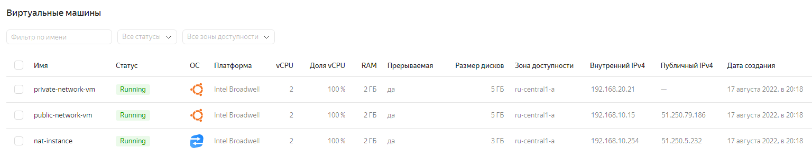
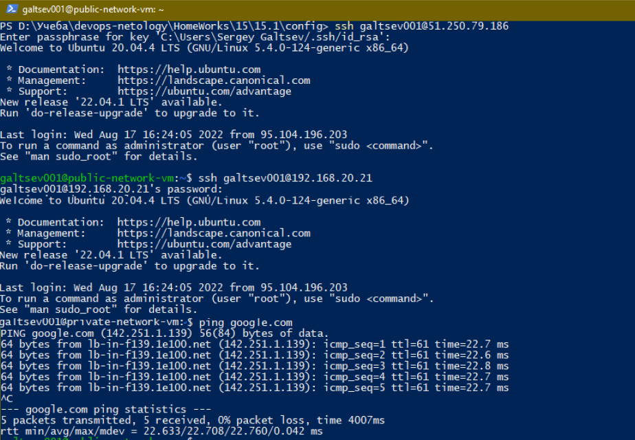

## 15.1. Организация сети

#### Задание 1. Яндекс.Облако (обязательное к выполнению)
+ Создать VPC.
  + Создать пустую VPC. Выбрать зону.
+ Публичная подсеть.
  + Создать в vpc subnet с названием public, сетью 192.168.10.0/24.
  + Создать в этой подсети NAT-инстанс, присвоив ему адрес 192.168.10.254. В качестве image_id использовать fd80mrhj8fl2oe87o4e1
  + Создать в этой публичной подсети виртуалку с публичным IP и подключиться к ней, убедиться что есть доступ к интернету.
+ Приватная подсеть.
  + Создать в vpc subnet с названием private, сетью 192.168.20.0/24.
  + Создать route table. Добавить статический маршрут, направляющий весь исходящий трафик private сети в NAT-инстанс
  + Создать в этой приватной подсети виртуалку с внутренним IP, подключиться к ней через виртуалку, созданную ранее и убедиться что есть доступ к интернету
 ___
**Ответ:**

+ [Конфигурация](./config/) состоит из 7 файлов:
  + [main.tf](./config/main.tf) - главный файл  
  + [nat.tf](./config/nat.tf) - настройки NAT  
  + [outputs.tf](./config/outpus.tf) - выходные данные 
  + [route-table.tf](./config/route-table.tf) - настройки маршрутизации
  + [subnets.tf](./config/subnets.tf) - конфигурация для подсетей 
  + [virtual-machines.tf](./config/main.tf) - конфигурация виртуальных машин  
  + [main.tf](./config/main.tf) - значения VPC

### Результаты работы в командной строке

```shell
#Используемые команды для выполнения задания 
  terraform init  
  terraform validate
  terraform fmt
  terraform plan
  terraform apply
```


### Результаты в Yandex Cloud

+ VPC


+ Subnets


+ Route table


+ Virtual PCs



### Проверка доступа

#### Public VM


#### Private VM

