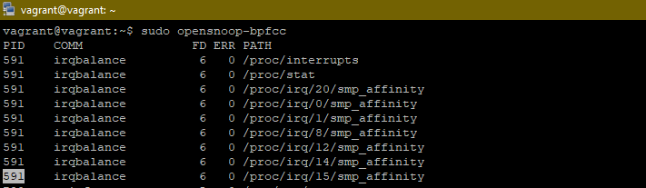
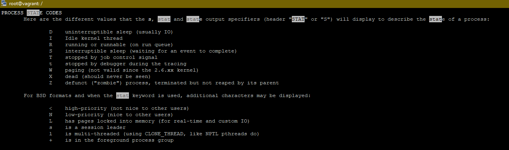
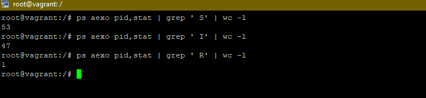

## 3.3. Операционные системы, лекция 1

1. Какой системный вызов делает команда `cd`? В прошлом ДЗ мы выяснили, что `cd` не является самостоятельной  программой, это `shell builtin`, поэтому запустить `strace` непосредственно на `cd` не получится. Тем не менее, вы можете запустить `strace` на `/bin/bash -c 'cd /tmp'`. В этом случае вы увидите полный список системных вызовов, которые делает сам `bash` при старте. Вам нужно найти тот единственный, который относится именно к `cd`.

    **Ответ:**
      ```
      vagrant@vagrant:/$ strace bash -c 'cd /tmp'
      ...
      chdir("/tmp")
      ...
    ```
  
2. Попробуйте использовать команду `file` на объекты разных типов на файловой системе. Например:

    ```bash
        vagrant@netology1:~$ file /dev/tty
        /dev/tty: character special (5/0)
        vagrant@netology1:~$ file /dev/sda
        /dev/sda: block special (8/0)
        vagrant@netology1:~$ file /bin/bash
        /bin/bash: ELF 64-bit LSB shared object, x86-64
    ```

   Используя `strace` выясните, где находится база данных `file` на основании которой она делает свои догадки.

    **Ответ:**
   ```bash
   /home/vagrant/.magic.mgc
   /home/vagrant/.magic
   /etc/magic.mgc
   /etc/magic
   /usr/share/misc/magic.mgc # линк на /usr/lib/file/magic.mgc
   ```
3. Предположим, приложение пишет лог в текстовый файл. Этот файл оказался удален (deleted в lsof), однако возможности сигналом сказать приложению переоткрыть файлы или просто перезапустить приложение – нет. Так как приложение продолжает писать в удаленный файл, место на диске постепенно заканчивается. Основываясь на знаниях о перенаправлении потоков предложите способ обнуления открытого удаленного файла (чтобы освободить место на файловой системе).

    **Ответ:**
    + Найдем PID интересующего нас процесса `sudo lsof | grep <file>`

    **PS** В нашем случае получим результат с пометкой в конце (deleted)
    + Теперь уточним файловый дескриптор зная PID `ls -l /proc/<PID>/fd`
    + Зная PID и файловый дескриптор обнулим его `cat /dev/null > /proc/<PID>/fd/<file descriptor>`


4. Занимают ли зомби-процессы какие-то ресурсы в ОС (CPU, RAM, IO)?

    **Ответ:**
   
    Цитатат из **wikipedia**

        Зомби не занимают памяти, но блокируют записи в таблице процессов, размер которой ограничен для каждого пользователя и системы в целом.
        При достижении лимита записей все процессы пользователя, от имени которого выполняется создающий зомби родительский процесс, не будут способны создавать новые дочерние процессы. Кроме этого, пользователь, от имени которого выполняется родительский процесс, не сможет зайти на консоль (локальную или удалённую) или выполнить какие-либо команды на уже открытой консоли (потому что для этого командный интерпретатор sh должен создать новый процесс), и для восстановления работоспособности (завершения виновной программы) будет необходимо вмешательство системного администратора.

5. В iovisor BCC есть утилита `opensnoop`:
    ```bash
      root@vagrant:~# dpkg -L bpfcc-tools | grep sbin/opensnoop
      /usr/sbin/opensnoop-bpfcc
    ```
   На какие файлы вы увидели вызовы группы `open` за первую секунду работы утилиты? Воспользуйтесь пакетом `bpfcc-tools` для Ubuntu 20.04. Дополнительные [сведения по установке](https://github.com/iovisor/bcc/blob/master/INSTALL.md).

    **Ответ:**

<span style="display:block;text-align:center"></span>

6. Какой системный вызов использует `uname -a`? Приведите цитату из man по этому системному вызову, где описывается альтернативное местоположение в `/proc`, где можно узнать версию ядра и релиз ОС.

    **Ответ:**
    + `uname -a` использует системный вызов `uname`
    + альтернатива находится в `/proc/sys/kernel/`


7. Чем отличается последовательность команд через `;` и через `&&` в bash? Например:
    ```bash
     root@netology1:~# test -d /tmp/some_dir; echo Hi
     Hi
     root@netology1:~# test -d /tmp/some_dir && echo Hi
     root@netology1:~#
    ```
   Есть ли смысл использовать в bash `&&`, если применить `set -e`?

    **Ответ:**
    + `;` - это простой разделитель команд
    + `&&` - это операнд тоже разделяет команды, но в отличии от первого, не даст выполнение команды с права без успешного выполнения команды слева
    + `set -e` - имеет похожее поведение как и `&&`


8. Из каких опций состоит режим bash `set -euxo pipefail` и почему его хорошо было бы использовать в сценариях?

    **Ответ:**
    ```
    -o option-name
       Set the variable corresponding to option-name:
           pipefail     the return value of a pipeline is the status of
                               the last command to exit with a non-zero status,
                               or zero if no command exited with a non-zero status
    ```
    Статусом выхода из конвейера, в том случае, если не включена опция pipefail, служит статус завершения последней команды конвейера.
    Если опция pipefail включена — статус выхода из конвейера является значением последней (самой правой) команды, завершённой с ненулевым статусом, или ноль — если работа всех команд завершена успешно.
    Причина использования pipefail заключается в том, что иначе команда, неожиданно завершившаяся с ошибкой и находящаяся где-нибудь в середине конвейера, обычно остаётся незамеченной.
    Она, если использовалась опция set -e, не приведёт к аварийному завершению скрипта.


9. Используя `-o stat` для `ps`, определите, какой наиболее часто встречающийся статус у процессов в системе. В `man ps` ознакомьтесь (`/PROCESS STATE CODES`) что значат дополнительные к основной заглавной буквы статуса процессов. Его можно не учитывать при расчете (считать S, Ss или Ssl равнозначными).

    + Запускаем справку `man ps` и находим выжимку по процессам
    + Просмотрим статусы нашей системы `ps aexo pid,stat`
    + Видим, что у нас в данный момент 3 типа процессов S, I и R.
      Считаем количество процессов по статусу:
    + Победил статус S (cпящий: ожидает завершения события)
      
<span style="display:block;text-align:center"></span>

<span style="display:block;text-align:center"></span>
