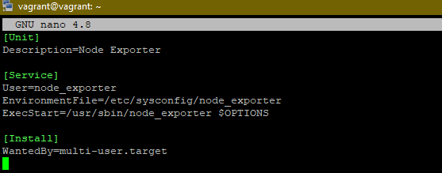
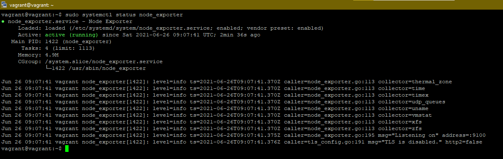
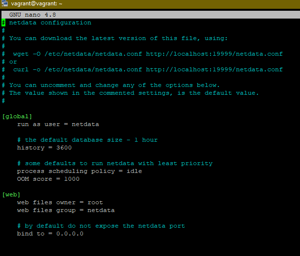
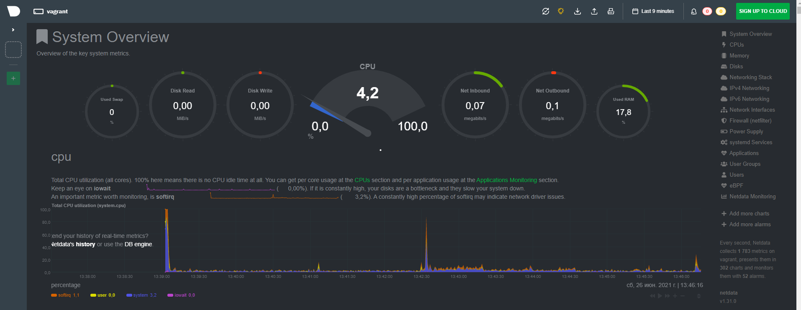
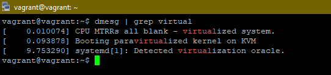
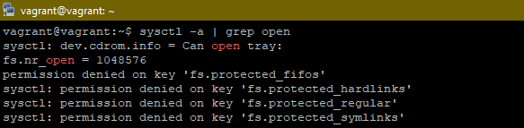
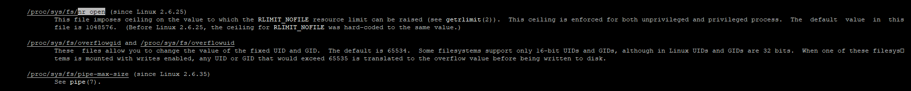
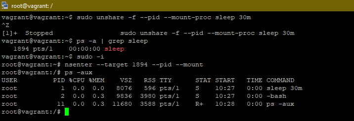
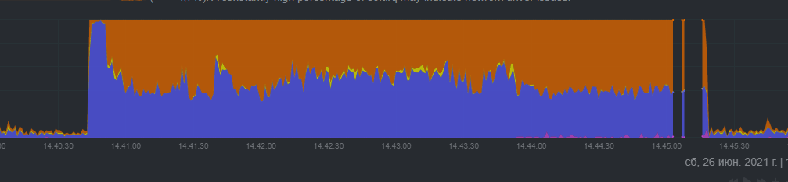

## 3.4. Операционные системы, лекция 2

#### 1. На лекции мы познакомились с node_exporter. В демонстрации его исполняемый файл запускался в background. Этого достаточно для демо, но не для настоящей production-системы, где процессы должны находиться под внешним управлением. Используя знания из лекции по systemd, создайте самостоятельно простой unit-файл для node_exporter:

        1) поместите его в автозагрузку
        2) предусмотрите возможность добавления опций к запускаемому процессу через внешний файл (посмотрите, например, на systemctl cat cron),
        3) удостоверьтесь, что с помощью systemctl процесс корректно стартует, завершается, а после перезагрузки автоматически поднимается.
**Ответ:**

1) Установка
   
       wget https://github.com/prometheus/node_exporter/releases/download/v1.1.2/node_exporter-1.1.2.linux-amd64.tar.gz
       tar xvfz node_exporter-1.1.2.linux-amd64.tar.gz
2) Копируем в системную папку `/usr/sbin/` запускаемый файл `node_exporte`

        sudo cp node_exporter-1.1.2.linux-amd64/node_exporter /usr/sbin/ 
3) Создаем пользователя node_exporter и делаем его "хозяйном" запускаемого файла

        sudo useradd node_exporter -s /sbin/nologin
        sudo chown node_exporter:node_exporter /usr/sbin/node_exporter
4) Создаем файл /etc/systemd/system/node_exporter.service
   
<span style="display:block;text-align:center"></span>

5) Создаем Sysconfig файл

         sudo mkdir -p /etc/sysconfig
         sudo touch /etc/sysconfig/node_exporter
         OPTIONS="--collector.textfile.directory /var/lib/node_exporter/textfile_collector"
6) Устанавливаем модуль в автозагрузку

         sudo systemctl daemon-reload
         sudo systemctl enable node_exporter

7) Запускаем модуль
         
         sudo systemctl start node_exporter

<span style="display:block;text-align:center"></span>
   
8) Смотрим метрики

По умолчанию они доступны по адресу нашей VM по 9100 порту

Например, смотрим так

`curl http://localhost:9100/metrics`


#### 2) Ознакомьтесь с опциями node_exporter и выводом /metrics по-умолчанию. Приведите несколько опций, которые вы бы выбрали для базового мониторинга хоста по CPU, памяти, диску и сети.
**Ответ:**

Стандартные коллекторы: cpu, diskstats, filesystem, hwmon, meminfo, netstat.

#### 3) Установите в свою виртуальную машину Netdata. Воспользуйтесь готовыми пакетами для установки (sudo apt install -y netdata). После успешной установки:

   + в конфигурационном файле /etc/netdata/netdata.conf в секции [web] замените значение с localhost на bind to = 0.0.0.0,
   + добавьте в Vagrantfile проброс порта Netdata на свой локальный компьютер и сделайте vagrant reload:
   ```config.vm.network "forwarded_port", guest: 19999, host: 19999```

**Ответ:**

1) Установка 

         curl -s https://packagecloud.io/install/repositories/netdata/netdata/script.deb.sh | sudo bash
         sudo apt install netdata
   
2) Устанавливаем доступ к web дашборду всем

<span style="display:block;text-align:center"></span>

3) Наблюдаем результаты в браузере после проброса порта 

<span style="display:block;text-align:center"></span>

#### 4) Можно ли по выводу `dmesg` понять, осознает ли ОС, что загружена не на настоящем оборудовании, а на системе виртуализации?

**Ответ:**

Понимает что она ОС построенна на системе виртуализации

<span style="display:block;text-align:center"></span>

#### 5) Как настроен sysctl fs.nr_open на системе по-умолчанию? Узнайте, что означает этот параметр. Какой другой существующий лимит не позволит достичь такого числа (ulimit --help)?

1) Используем для поиска информации `man sysctl`. Из документации понимаем что это переменная для ядра

2) Проверим это с помощью кодманды `sysctl -a | grep open`. Видим что это действительно переменная и она имеет значение 1048576, но пока еще не понимаем что это.

<span style="display:block;text-align:center"></span>

3) Основная масса переменных отображена в каталоге `/proc`. Поищем информацию при помощи `man proc`

<span style="display:block;text-align:center"></span>

Полученная информация говорит что `fs.nr_open` - это лимит системы на кол-во открытых файлов

4) Но команда `ulimit -n -H` говорит что мы сможем открыть максимум 1024 файла

#### 6) Запустите любой долгоживущий процесс (не ls, который отработает мгновенно, а, например, sleep 1h) в отдельном неймспейсе процессов; покажите, что ваш процесс работает под PID 1 через nsenter. Для простоты работайте в данном задании под root (sudo -i). Под обычным пользователем требуются дополнительные опции (--map-root-user) и т.д.

**Ответ:**

<span style="display:block;text-align:center"></span>

#### 7) Найдите информацию о том, что такое :(){ :|:& };:. Запустите эту команду в своей виртуальной машине Vagrant с Ubuntu 20.04 (это важно, поведение в других ОС не проверялось). Некоторое время все будет "плохо", после чего (минуты) – ОС должна стабилизироваться. Вызов dmesg расскажет, какой механизм помог автоматической стабилизации. Как настроен этот механизм по-умолчанию, и как изменить число процессов, которое можно создать в сессии?

Через некоторое время после запуска было много сообщений как показано ниже

      -bash: fork: Resource temporarily unavailable. 

В выводе dmesg нашлось:
      
      cgroup: fork rejected by pids controller in /user.slice/user-1000.slice/session-4.scope

NetData показал следующее:

<span style="display:block;text-align:center"></span>

При помощи cgroups можно ограничить количество создаваемых процессов, при помощи контроллера CONFIG_CGROUP_PIDS.