## 3.5. Файловые системы

### 1) Узнайте о sparse (разряженных) файлах.

**Разрежённый файл (англ. sparse file)** — файл, в котором последовательности нулевых байтов[1] заменены на информацию об этих последовательностях (список дыр).

**Дыра (англ. hole)** — последовательность нулевых байт внутри файла, не записанная на диск. Информация о дырах (смещение от начала файла в байтах и количество байт) хранится в метаданных ФС.

### 2) Могут ли файлы, являющиеся жесткой ссылкой на один объект, иметь разные права доступа и владельца? Почему?

Нет. 

Жесткая ссылка и файл, для которой она создавалась имеют одинаковые `inode`. Поэтому жесткая ссылка имеет те же права доступа, владельца и время последней модификации, что и целевой файл. Различаются только имена файлов. Фактически жесткая ссылка это еще одно имя для файла.

### 3) Сделайте vagrant destroy на имеющийся инстанс Ubuntu. Замените содержимое Vagrantfile следующим:
```bash
    Vagrant.configure("2") do |config|
      config.vm.box = "bento/ubuntu-20.04"
      config.vm.provider :virtualbox do |vb|
        lvm_experiments_disk0_path = "/tmp/lvm_experiments_disk0.vmdk"
        lvm_experiments_disk1_path = "/tmp/lvm_experiments_disk1.vmdk"
        vb.customize ['createmedium', '--filename', lvm_experiments_disk0_path, '--size', 2560]
        vb.customize ['createmedium', '--filename', lvm_experiments_disk1_path, '--size', 2560]
        vb.customize ['storageattach', :id, '--storagectl', 'SATA Controller', '--port', 1, '--device', 0, '--type', 'hdd', '--medium', lvm_experiments_disk0_path]
        vb.customize ['storageattach', :id, '--storagectl', 'SATA Controller', '--port', 2, '--device', 0, '--type', 'hdd', '--medium', lvm_experiments_disk1_path]
      end
    end
```
### Данная конфигурация создаст новую виртуальную машину с двумя дополнительными неразмеченными дисками по 2.5 Гб.

<span style="display:block;text-align:center">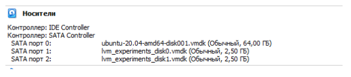</span>

<span style="display:block;text-align:center">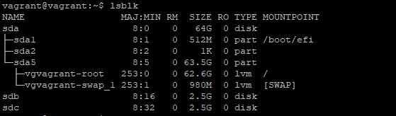</span>

### 4) Используя fdisk, разбейте первый диск на 2 раздела: 2 Гб, оставшееся пространство.

<span style="display:block;text-align:center">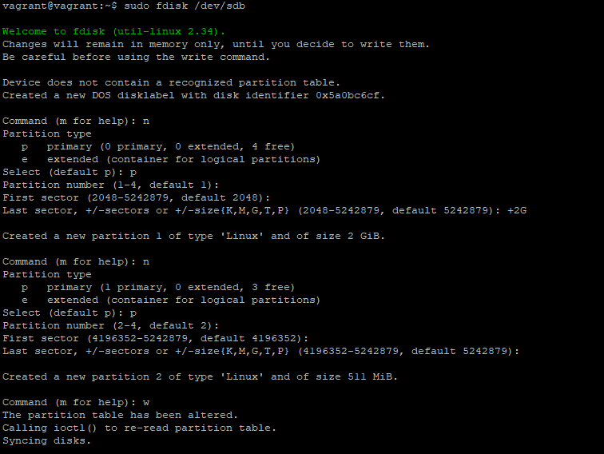</span>

<span style="display:block;text-align:center">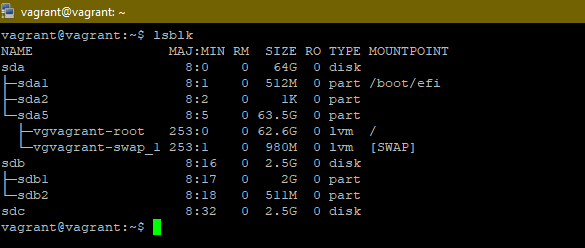</span>

### 5) Используя sfdisk, перенесите данную таблицу разделов на второй диск.

<span style="display:block;text-align:center">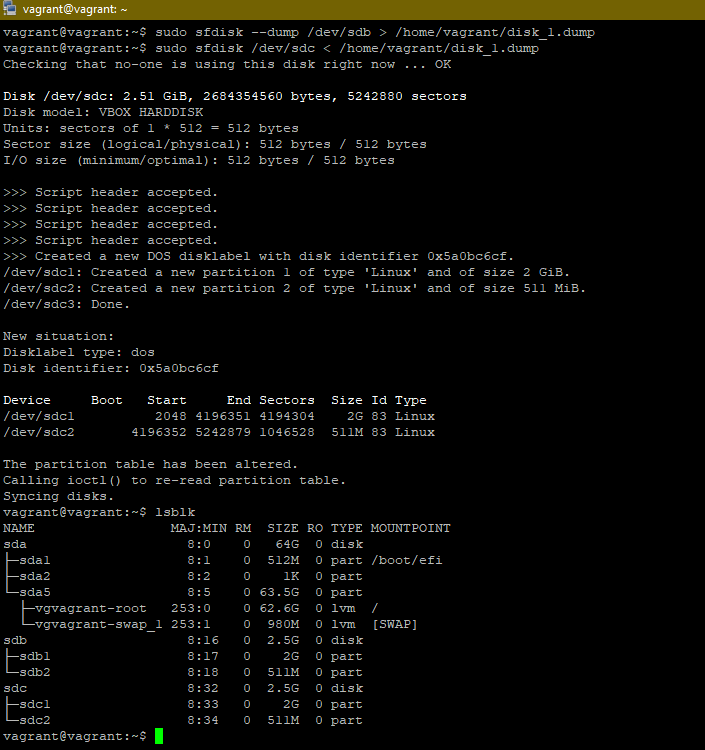</span>

### 6) Соберите mdadm RAID1 на паре разделов 2 Гб.

<span style="display:block;text-align:center">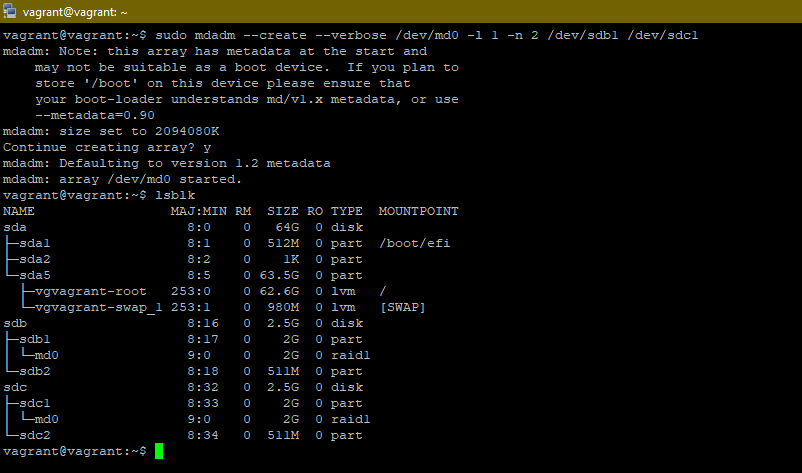</span>

### 7) Соберите mdadm RAID0 на второй паре маленьких разделов.

<span style="display:block;text-align:center">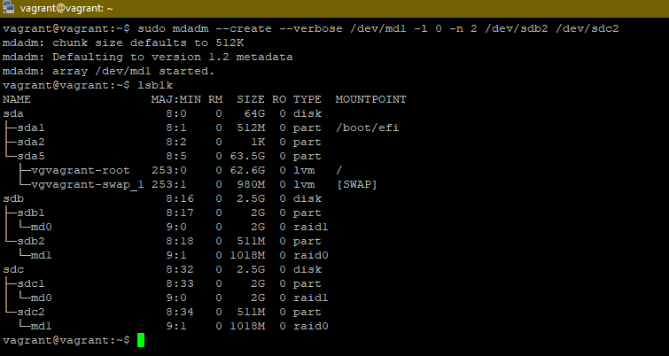</span>

### 8) Создайте 2 независимых PV на получившихся md-устройствах.

<span style="display:block;text-align:center">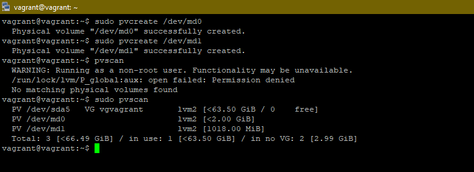</span>

### 9) Создайте общую volume-group на этих двух PV.

<span style="display:block;text-align:center">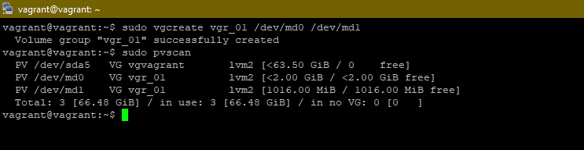</span>

### 10) Создайте LV размером 100 Мб, указав его расположение на PV с RAID0.

<span style="display:block;text-align:center">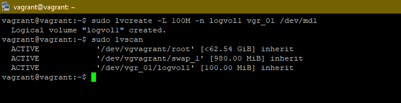</span>

### 11) Создайте mkfs.ext4 ФС на получившемся LV

<span style="display:block;text-align:center">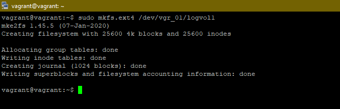</span>

### 12) Смонтируйте этот раздел в любую директорию, например, /tmp/new

<span style="display:block;text-align:center">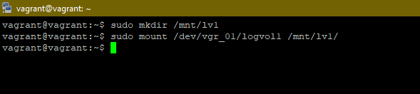</span>

### 13) Поместите туда тестовый файл, например wget https://mirror.yandex.ru/ubuntu/ls-lR.gz -O /tmp/new/test.gz.

<span style="display:block;text-align:center">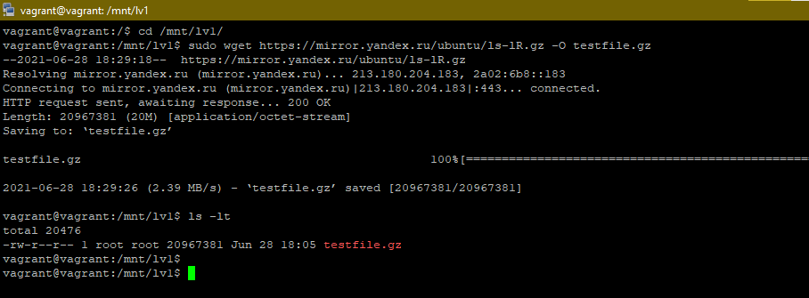</span>

### 14) Прикрепите вывод lsblk

<span style="display:block;text-align:center">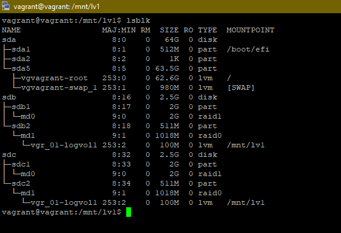</span>

### 15) Протестируйте целостность файла:
```bash
root@vagrant:~# gzip -t /tmp/new/test.gz
root@vagrant:~# echo $?
0
```

<span style="display:block;text-align:center">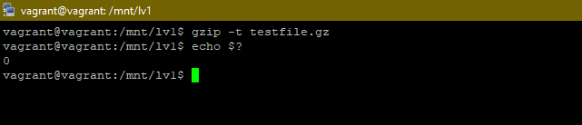</span>

### 16) Используя pvmove, переместите содержимое PV с RAID0 на RAID1.

<span style="display:block;text-align:center">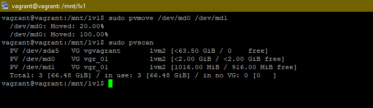</span>

### 17) Сделайте --fail на устройство в вашем RAID1 md.

<span style="display:block;text-align:center">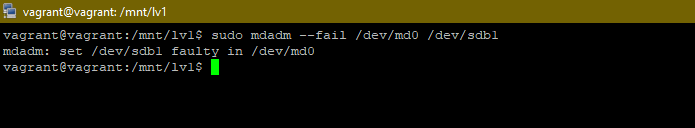</span>

### 18) Подтвердите выводом dmesg, что RAID1 работает в деградированном состоянии.

<span style="display:block;text-align:center">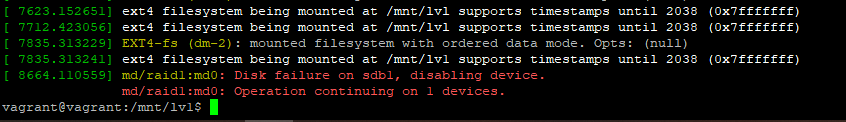</span>

### 19) Протестируйте целостность файла, несмотря на "сбойный" диск он должен продолжать быть доступен:
```bash
root@vagrant:~# gzip -t /tmp/new/test.gz
root@vagrant:~# echo $?
0
```

<span style="display:block;text-align:center">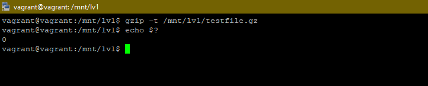</span>


