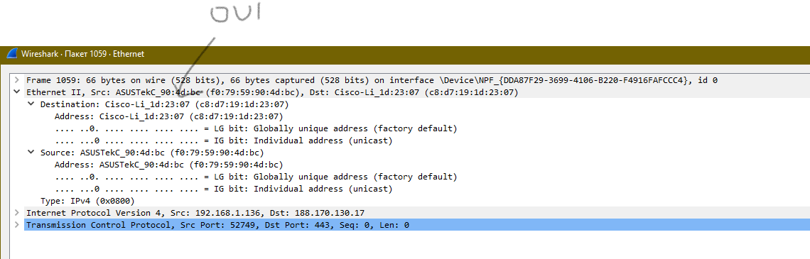

## 3.6. Компьютерные сети, лекция 1

### 1) Необязательное задание: можно посмотреть целый фильм в консоли telnet towel.blinkenlights.nl

Не получилось :((( Смотрел примеры на Youtube

### 2) Узнайте о том, сколько действительно независимых (не пересекающихся) каналов есть в разделяемой среде WiFi при работе на 2.4 ГГц. Стандарты с полосой 5 ГГц более актуальны, но регламенты на 5 ГГц существенно различаются в разных странах, а так же не раз обновлялись. В качестве дополнительного вопроса вне зачета, попробуйте найти актуальный ответ и на этот вопрос.

**2.4 Гц** - `1, 6 и 11` каналы

**5 Гц** - `36, 40, 44, 48, 52, 56, 60, 64` каналы  

### 3) Адрес канального уровня – MAC адрес – это 6 байт, первые 3 из которых называются OUI – Organizationally Unique Identifier или уникальный идентификатор организации. Какому производителю принадлежит MAC `38:f9:d3:55:55:79`?

### 4) Каким будет payload TCP сегмента, если Ethernet MTU задан в 9001 байт, размер заголовков IPv4 – 20 байт, а TCP – 32 байта?

9001-20-32 = **8949 байт**

### 5) Может ли во флагах TCP одновременно быть установлены флаги SYN и FIN при штатном режиме работы сети? Почему да или нет?

`SYN` - установка соединения

`FIN` - завершение соединения. 

Работа двух флагов одновременно недопустимо.

### 6) ss -ula sport = :53 на хосте имеет следующий вывод:

        State           Recv-Q          Send-Q                   Local Address:Port                     Peer Address:Port          Process
        UNCONN          0               0                        127.0.0.53%lo:domain                        0.0.0.0:*
Почему в State присутствует только `UNCONN`, и может ли там присутствовать, например, `TIME-WAIT`?

ss с аргументом -u означает отображение сокетов udp-протокола. TIME_WAIT же используется в протоколе TCP для подтверждения закрытия соединения, которое не используется для UDP. Поэтому, ответ нет.

### 7) Обладая знаниями о том, как штатным образом завершается соединение (FIN от инициатора, FIN-ACK от ответчика, ACK от инициатора), опишите в каких состояниях будет находиться TCP соединение в каждый момент времени на клиенте и на сервере при завершении. Схема переходов состояния соединения вам в этом поможет.

|     src    |  ---  |           dst           |
|:----------:|:-----:|:-----------------------:|
|     FIN    |  -->  |       FIN CLOSING       |
|     ACK    |  <--  |           ACK           |
| FIN WAIT 1 |       |        CLOSE WAIT       |
|     FIN    |  <--  |           FIN           |
| FIN WAIT 2 |       |                         |
|   FIN/ACK  |  -->  | FIN/ACK TIME WAIT CLOSE |

### 8) TCP порт – 16 битное число. Предположим, 2 находящихся в одной сети хоста устанавливают между собой соединения. Каким будет теоретическое максимальное число соединений, ограниченное только лишь параметрами L4, которое параллельно может установить клиент с одного IP адреса к серверу с одним IP адресом? Сколько соединений сможет обслужить сервер от одного клиента? А если клиентов больше одного?

Подключение осуществляется по портам, их максимальное кол-во `65535`.

### 9) Может ли сложиться ситуация, при которой большое число соединений TCP на хосте находятся в состоянии TIME-WAIT? Если да, то является ли она хорошей или плохой? Подкрепите свой ответ пояснением той или иной оценки.

`TIME_WAIT` - занимает порт, соответственно при большом кол-ве таких состояний мы можем стать недоступными. Исправить ситуацию можно настроив время жизни такого состояния.

### 10) Может ли сложиться ситуация, при которой большое число соединений TCP на хосте находятся в состоянии TIME-WAIT? Если да, то является ли она хорошей или плохой? Подкрепите свой ответ пояснением той или иной оценки.

UDP - это протокол, задача которого доставить как можно больше за короткий промежуток времени. При фрагментации, мы можем получить пакеты, которые будут при ходить не попорядку, либо теряться в просторах сети.

### 11) Если бы вы строили систему удаленного сбора логов, то есть систему, в которой несколько хостов отправяют на центральный узел генерируемые приложениями логи (предположим, что логи – текстовая информация), какой протокол транспортного уровня вы выбрали бы и почему? Проверьте ваше предположение самостоятельно, узнав о стандартном протоколе syslog.

Мой выбор - `TCP`. Логи являются важной частью, поэтому нам необходима гарантированная доставка таких сообщений.

`syslog` по умолчанию использует `UDP`, но если я правильно понял, можно настроить его работу через `TCP`  

### 12) Сколько портов TCP находится в состоянии прослушивания на вашей виртуальной машине с Ubuntu, и каким процессам они принадлежат?

### 13) Какой ключ нужно добавить в tcpdump, чтобы он начал выводить не только заголовки, но и содержимое фреймов в текстовом виде? А в текстовом и шестнадцатиричном?

`-A `- вывода текста ASCII

`-x` - шестнадцатиричном

`-Xx` - текст + шестнадцатиричном

### 14) Попробуйте собрать дамп трафика с помощью tcpdump на основном интерфейсе вашей виртуальной машины и посмотреть его через tshark или Wireshark (можно ограничить число пакетов -c 100). Встретились ли вам какие-то установленные флаги Internet Protocol (не флаги TCP, а флаги IP)? Узнайте, какие флаги бывают. Как на самом деле называется стандарт Ethernet, фреймы которого попали в ваш дамп? Можно ли где-то в дампе увидеть OUI?

Флаги IP существуют следующие:

+ bit 0: Reserved; must be zero
+ bit 1: Don't Fragment (DF)
+ bit 2: More Fragments (MF)

Сделал следующее:

Мне не попались :(((

Возможно стоило набраться терпения и подождать чуть больше времени

