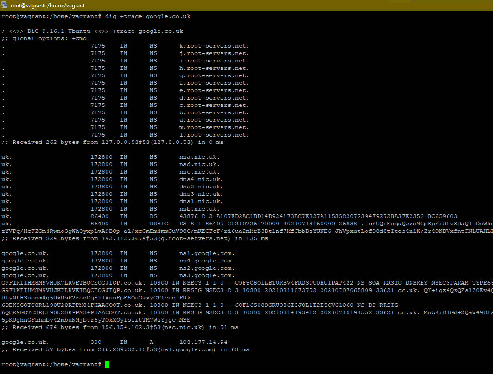

## 3.7. Компьютерные сети, лекция 2

#### 1) На лекции мы обсудили, что манипулировать размером окна необходимо для эффективного наполнения приемного буфера участников TCP сессии (Flow Control). Подобная проблема в полной мере возникает в сетях с высоким RTT. Например, если вы захотите передать 500 Гб бэкап из региона Юга-Восточной Азии на Восточное побережье США. Здесь вы можете увидеть и 200 и 400 мс вполне реального RTT. Подсчитайте, какого размера нужно окно TCP чтобы наполнить 1 Гбит/с канал при 300 мс RTT (берем простую ситуацию без потери пакетов). Можно воспользоваться готовым калькулятором. Ознакомиться с формулами, по которым работает калькулятор можно, например, на Wiki.

```bash   
 1000000000_бит/с * 0.3_сек = 300000000_бит / 8 = 37500000_байтов.
 maximum throughput with a TCP window of 37500 KByte and RTT of 300.0 ms <= 1024.00 Mbit/sec.
```

#### 2) Во сколько раз упадет пропускная способность канала, если будет 1% потерь пакетов при передаче?

В 1000 раз.

#### 3) Какая максимальная реальная скорость передачи данных достижима при линке 100 Мбит/с? Вопрос про TCP payload, то есть цифры, которые вы реально увидите в операционной системе в тестах или в браузере при скачивании файлов. Повлияет ли размер фрейма на это?

Playload в TCP (Max):

```bash
 = (MTU–TCP–IP) / (MTU+Ethernet+IFG) = (1500–20-20) / (1500+7+1+6+6+2+4+12) = 94.9_% (94.9_Мбит/c)
```
Размер фрейма влияет на скорость. Большие фреймы несут в себе больше служебных данных, маленькие больше требуемой информации.

#### 4) Что на самом деле происходит, когда вы открываете сайт? :) На прошлой лекции был приведен сокращенный вариант ответа на этот вопрос. Теперь вы знаете намного больше, в частности про IP адресацию, DNS и т.д. Опишите максимально подробно насколько вы это можете сделать, что происходит, когда вы делаете запрос curl -I http://netology.ru с вашей рабочей станции. Предположим, что arp кеш очищен, в локальном DNS нет закешированных записей.

+ Формируется запрос на получения IP netology.ru к DNS, который указан в локальной сети
+ Локальный DNS перенаправит запрос на корневые серверы -> серверы домена RU -> серверы netology
+ Получаем IP
+ Отправляем запрос на 80 порт используя протокол HTTP

**Доработка**

 Выжиммка из Wikipedia

        Если хост с IPv4 адресом 10.10.10.123 и MAC адресом 00:0D:9D:86:59:E2 хочет послать пакет другому хосту с адресом 10.10.10.140, но не знает его MAC адрес, то он должен послать ARP запрос для разрешения адреса.

        Пакет, изображённый ниже, изображает широковещательный запрос. Если хост с IP 10.10.10.140 присутствует в сети и доступен, то он получает этот запрос ARP и возвращает ответ.


Получается ARP протокол, может сформироваться на любой точке описанной выше.
В моем примере точно (`arp таблица` очищена) сформируется перед запросом к DNS (IP DNS знаем MAC - нет)

И после получения IP сервера `netology` компьютер сформирует ARP запрос, чтобы выяснить не находится ли `netology` в нашей локальной сети

#### 5) Сколько и каких итеративных запросов будет сделано при резолве домена www.google.co.uk?

=> Local DNS => Корневой DNS => зона UK => перенаправление на CO.UK => www.google.co.uk => Получение IP

Более подробнее на рисунке ниже 

<span style="display:block;text-align:center"></span>

#### 6) Сколько доступно для назначения хостам адресов в подсети /25? А в подсети с маской 255.248.0.0. Постарайтесь потренироваться в ручных вычислениях чтобы немного набить руку, не пользоваться калькулятором сразу.

В подсети /25 - 126 адресов.
В подсети с маской 255.248.0.0 - 524 286 адресов

#### 7) В какой подсети больше адресов, в /23 или /24?

В 23 подсети - 512 адресов, а в 24 подсети - 256. Соответствено в `23 - больше`

#### 8) Получится ли разделить диапазон 10.0.0.0/8 на 128 подсетей по 131070 адресов в каждой? Какая маска будет у таких подсетей?

`255.254.0.0  -> /15.`

