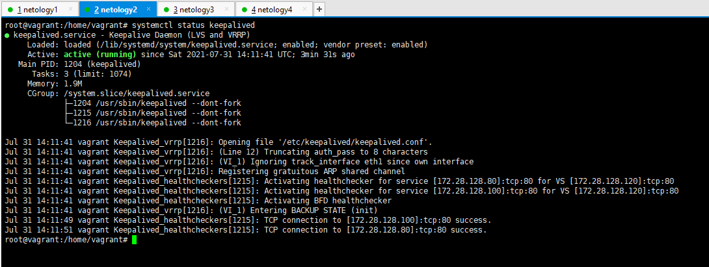

## 3.8. Компьютерные сети, лекция 3

#### 1) `ipvs`. Если при запросе на VIP сделать подряд несколько запросов (например, `for i in {1..50}; do curl -I -s 172.28.128.200>/dev/null; done )`, ответы будут получены почти мгновенно. Тем не менее, в выводе ipvsadm -Ln еще некоторое время будут висеть активные InActConn. Почему так происходит?

**Ответ**

`InActConn` - это все состояния соединений кроме ESTABLISHED.

Для LVS типа DR и LVS-Tun директор не видит пакетов от реального сервера к клиенту. А для завершения tcp-соединения происходит отправка FIN с последующим ответом ACK с другого конца. Затем второй участник посылает свой FIN, за которым следует ACK от первой машины.
Однако если реальный сервер инициирует прекращение соединения, директор сможет сделать вывод о том, что это произошло, только увидев ACK от клиента. Директор вынужден делать вывод, что соединение закрыто из частичной информации, и использует свою собственную таблицу тайм-аутов, чтобы объявить, что соединение прервано. Таким образом в колонке InActConn могут быть видны еще некоторое время соединения как активные.

#### 2) На лекции мы познакомились отдельно с ipvs и отдельно с keepalived. Воспользовавшись этими знаниями, совместите технологии вместе (VIP должен подниматься демоном keepalived). Приложите конфигурационные файлы, которые у вас получились, и продемонстрируйте работу получившейся конструкции. Используйте для директора отдельный хост, не совмещая его с риалом! Подобная схема возможна, но выходит за рамки рассмотренного на лекции.

**Ответ**

Будем реализовывать следующую схему:

Имеем

|     Название       |      IP         |       Примечание        |
|:------------------:|:---------------:|:-----------------------:|
|     Netology1      |  172.28.128.10  |    Директор (Мастер)    |
|     Netology2      |  172.28.128.40  |    Директор (Backup)    |
|     Netology3      |  172.28.128.80  |           Хост          |
|     Netology4      |  172.28.128.100 |           Хост          |
|       Web #1       |  172.28.128.120 |        Virtual IP       |

+ [Конфигурация netology #1](./config/netology1.md)
+ [Конфигурация netology #2](./config/netology2.md)
+ [Конфигурация netology #3](./img/netology3.png)
+ [Конфигурация netology #4](./img/netology4.png)

#### Netology 1

#### Netology 2

#### 3) В лекции мы использовали только 1 VIP адрес для балансировки. У такого подхода несколько отрицательных моментов, один из которых – невозможность активного использования нескольких хостов (1 адрес может только переехать с master на standby). Подумайте, сколько адресов оптимально использовать, если мы хотим без какой-либо деградации выдерживать потерю 1 из 3 хостов при входящем трафике 1.5 Гбит/с и физических линках хостов в 1 Гбит/с? Предполагается, что мы хотим задействовать 3 балансировщика в активном режиме (то есть не 2 адреса на 3 хоста, один из которых в обычное время простаивает).

**Ответ**

Вероятнее всего для работы трех балансеровщиков потребуется использование 3-х VIP Задачу по распределению IP адресов для данных устройств будет лежать на DNS, либо использования маршрутизации ANYCAST
