## 3.9. Элементы безопасности информационных систем

#### 1) Установите Hashicorp Vault в виртуальной машине Vagrant/VirtualBox. Это не является обязательным для выполнения задания, но для лучшего понимания что происходит при выполнении команд (посмотреть результат в UI), можно по аналогии с netdata из прошлых лекций пробросить порт Vault на localhost:
```bash
config.vm.network "forwarded_port", guest: 8200, host: 8200
```
Однако, обратите внимание, что только-лишь проброса порта не будет достаточно – по-умолчанию Vault слушает на 127.0.0.1; добавьте к опциям запуска -dev-listen-address="0.0.0.0:8200".

***Ответ***

<span style="display:block;text-align:center">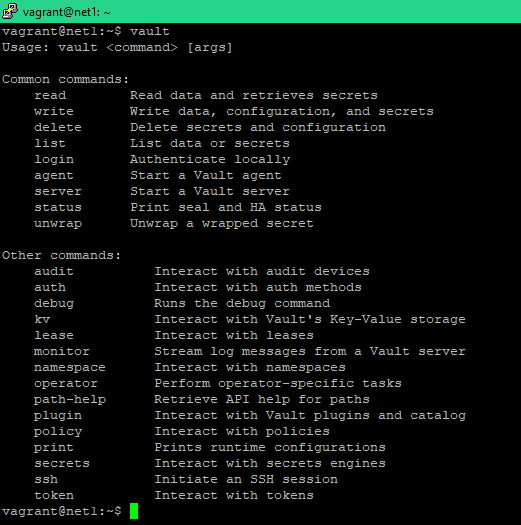</span>

#### 2) Запустить Vault-сервер в dev-режиме (дополнив ключ -dev упомянутым выше -dev-listen-address, если хотите увидеть UI).

***Ответ***

<span style="display:block;text-align:center">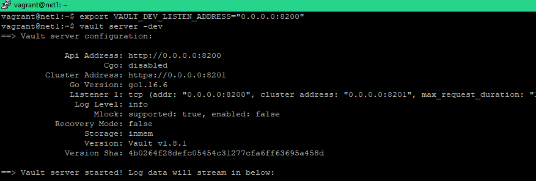</span>

<span style="display:block;text-align:center">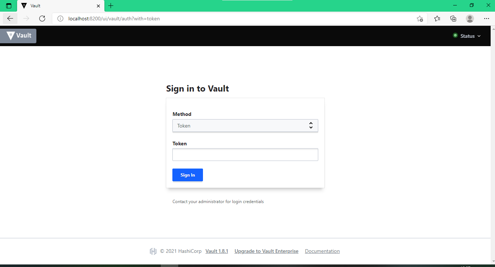</span>

#### 3) Используя PKI Secrets Engine, создайте Root CA и Intermediate CA. Обратите внимание на дополнительные материалы по созданию CA в Vault, если с изначальной инструкцией возникнут сложности.

***Ответ***

Делал через  WEB UI по официальной инструкции [Здесь](https://learn.hashicorp.com/tutorials/vault/pki-engine)

+ **ROOT CA**

<span style="display:block;text-align:center">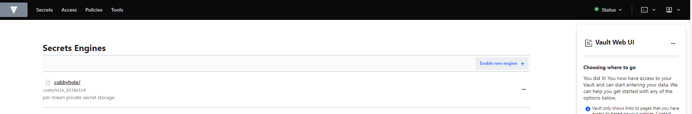</span>
<span style="display:block;text-align:center">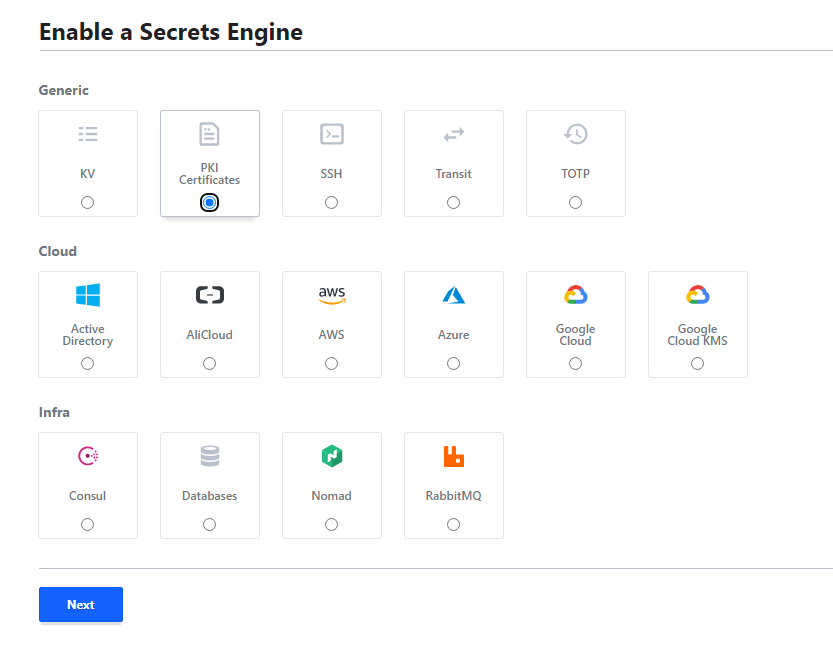</span>
<span style="display:block;text-align:center">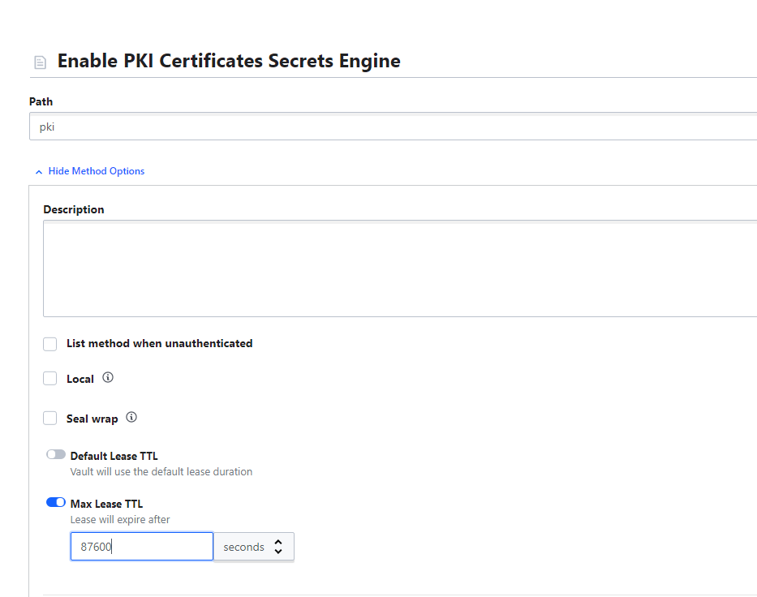</span>
<span style="display:block;text-align:center">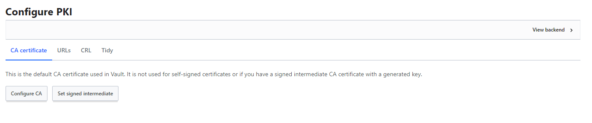</span>
<span style="display:block;text-align:center">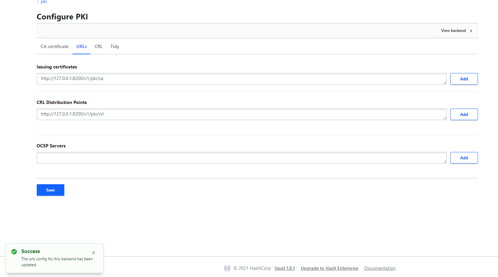</span>
<span style="display:block;text-align:center">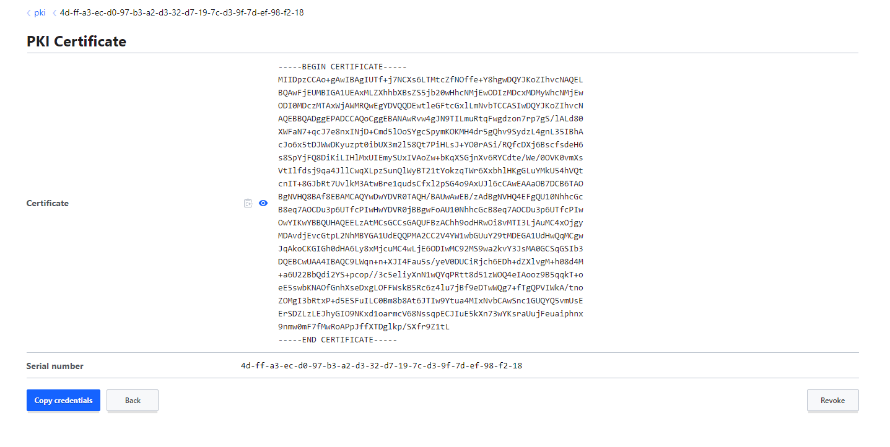</span>

+ **Intermediate CA**

<span style="display:block;text-align:center">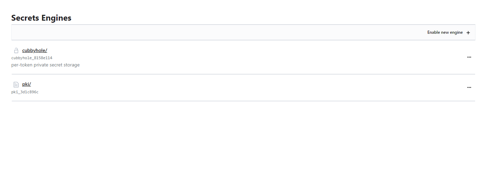</span>
<span style="display:block;text-align:center">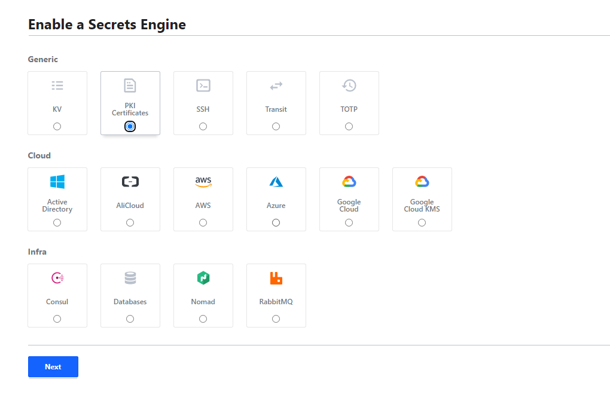</span>
<span style="display:block;text-align:center">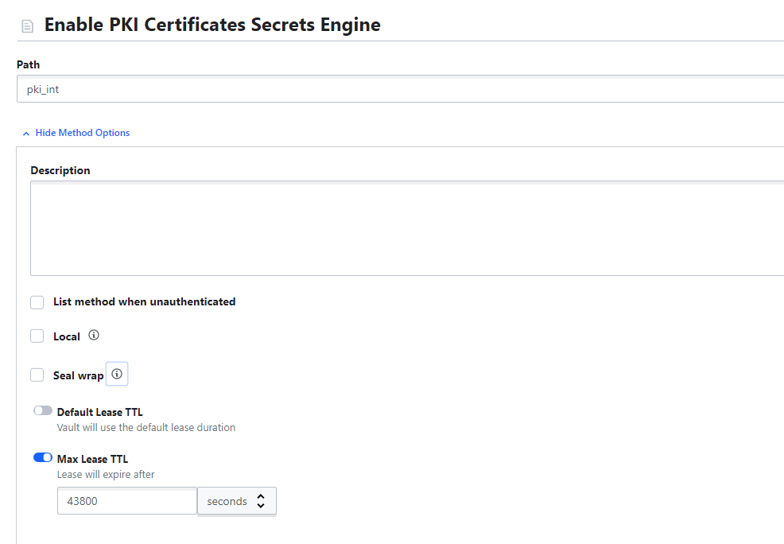</span>
<span style="display:block;text-align:center">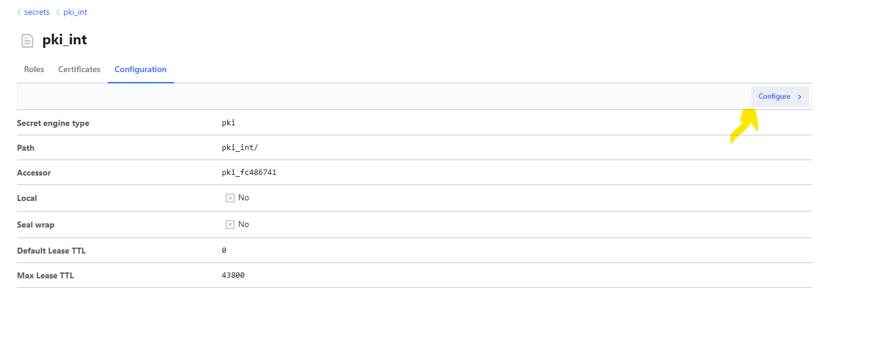</span>
<span style="display:block;text-align:center">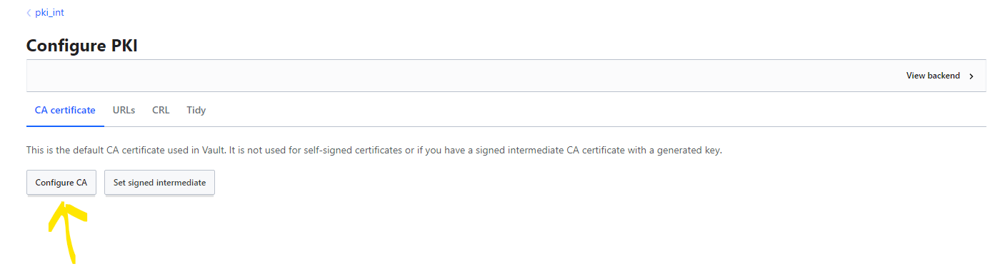</span>
<span style="display:block;text-align:center">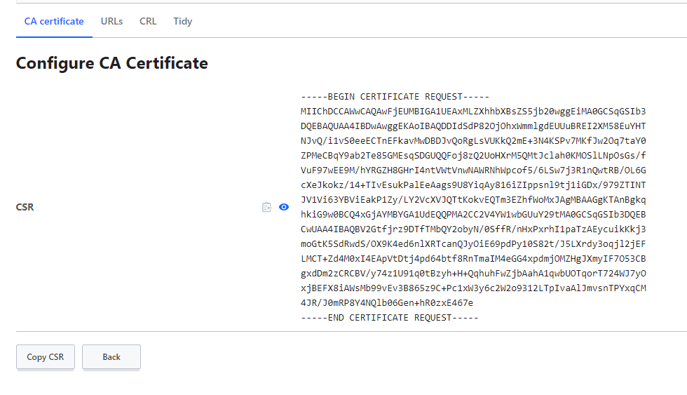</span>

#### 4) Согласно этой же инструкции, подпишите Intermediate CA csr на сертификат для тестового домена (например, netology.example.com если действовали согласно инструкции).

***Ответ***

<span style="display:block;text-align:center">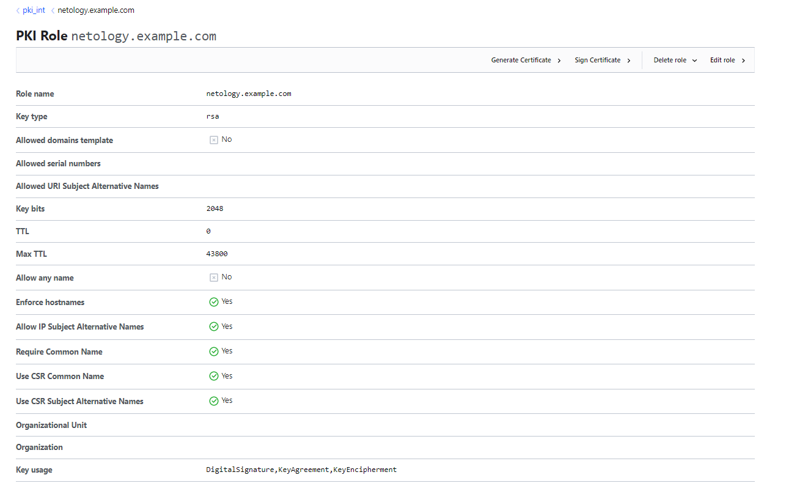</span>
<span style="display:block;text-align:center">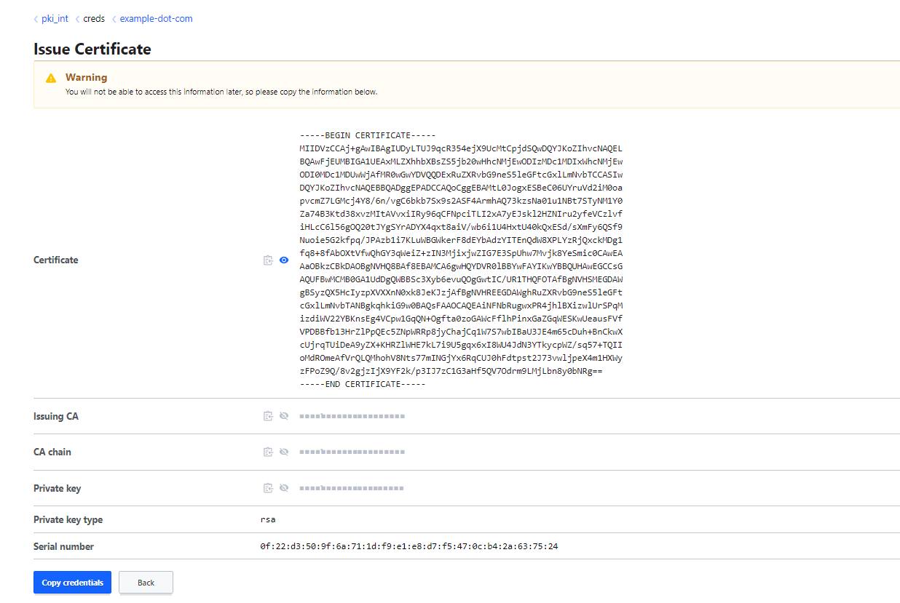</span>

#### 5) Поднимите на localhost nginx, сконфигурируйте default vhost для использования подписанного Vault Intermediate CA сертификата и выбранного вами домена. Сертификат из Vault подложить в nginx руками.

***Ответ***

+ Создал папки, где будут храниться ключи

<span style="display:block;text-align:center">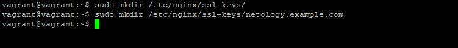</span>

+ Cформировал два файла `netology.example.com.pem` & `netology.example.com.key`
+ `netology.example.com.pem` - содержит Certificate, Issuing CA, CA chain
+ `netology.example.com.key` - Private key
+ Файлы сохранил по данному пути `/etc/nginx/ssl-keys/netology.example.com/`

<span style="display:block;text-align:center">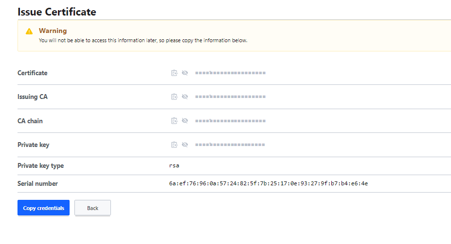</span>

+ Изменил настройки NGINX

<span style="display:block;text-align:center">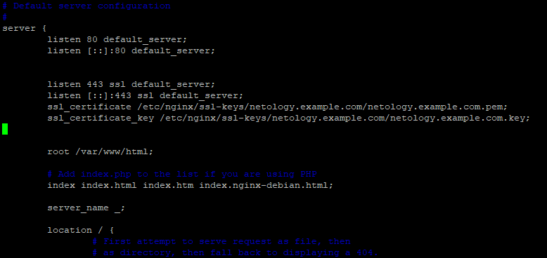</span>

+ Проверка и перезапуск веб сервера

<span style="display:block;text-align:center">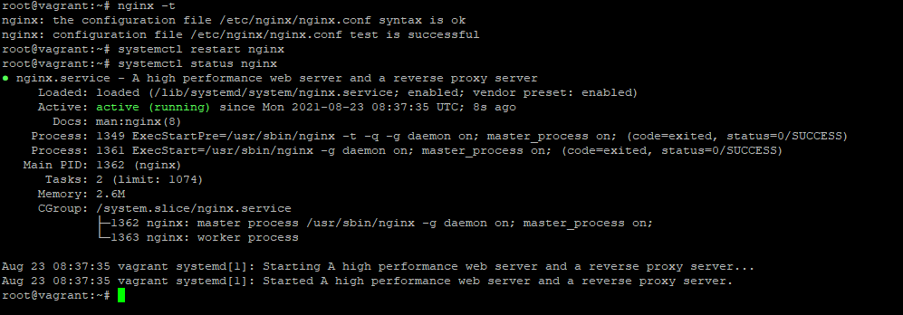</span>

#### 6) Модифицировав /etc/hosts и системный trust-store, добейтесь безошибочной с точки зрения HTTPS работы curl на ваш тестовый домен (отдающийся с localhost). Рекомендуется добавлять в доверенные сертификаты Intermediate CA. Root CA добавить было бы правильнее, но тогда при конфигурации nginx потребуется включить в цепочку Intermediate, что выходит за рамки лекции. Так же, пожалуйста, не добавляйте в доверенные сам сертификат хоста.

***Ответ***

+ Изменяем файлик `hosts`

<span style="display:block;text-align:center">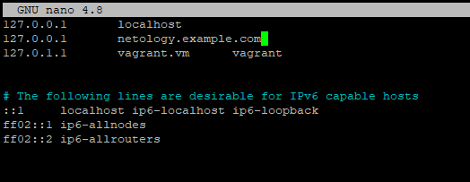</span>

+ Копируем сертификат из  vault (PKI_INIT)

<span style="display:block;text-align:center">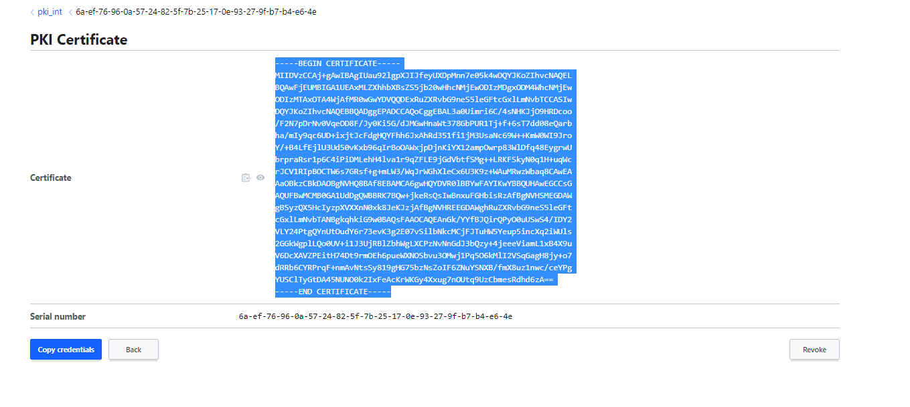</span>

+ Создаем текстовый файлик `ca.crt` и копируем его в хранилище сертификатов, обновляем и проверяем что у нас получилось

<span style="display:block;text-align:center">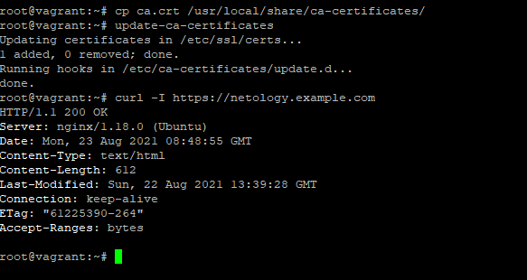</span>

#### 7) Ознакомьтесь с протоколом ACME и CA Let's encrypt. Если у вас есть во владении доменное имя с платным TLS-сертификатом, который возможно заменить на LE, или же без HTTPS вообще, попробуйте воспользоваться одним из предложенных клиентов, чтобы сделать веб-сайт безопасным (или перестать платить за коммерческий сертификат).

Спасибо за информацию. Ознакомился )))


