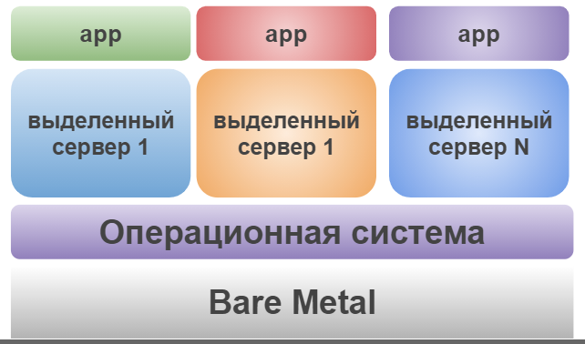
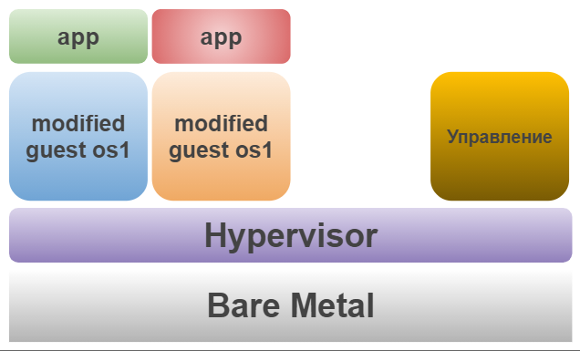

## 5.1. Основы виртуализации

#### 1) Вкратце опишите, как вы поняли - в чем основное отличие паравиртуализации и виртуализации на основе ОС.

***Ответ:***

**Виртуализация на основе ОС** - Виртуализация уровня операционной системы изолирует виртуальные сервера. Слой виртуализации ОС обеспечивает изоляцию и безопасность ресурсов между различными контейнерами, делает каждый контейнер похожим на физический сервер. Каждый контейнер обслуживает приложения в нем и рабочую нагрузку.

**Паравиртуализация** - гостевая ОС понимает что она находится в виртуальной среде, соответственно, имеет драйверы, которые вместо выдачи аппаратных команд просто выдают команды непосредственно операционной системе хоста.

#### 2) Выберите тип один из вариантов использования организации физических серверов, в зависимости от условий использования.

***Организация серверов:***

+ Физические сервера
+ паравиртуализация
+ виртуализация уровня ОС

***Условия использования***

+ Высоконагруженная база данных, чувствительная к отказу
+ Различные Java-приложения
+ Windows системы для использования Бухгалтерским отделом
+ Системы, выполняющие высокопроизводительные расчеты на GPU

Опишите, почему вы выбрали к каждому целевому использованию такую организацию.

***Ответ:***

+ Высоконагруженная база данных, чувствительная к отказу => Физические сервера *(Лучшая производительность)*
+ Различные Java-приложения => виртуализация уровня ОС *(Золотая середина)*
+ Windows системы для использования Бухгалтерским отделом => виртуализация уровня ОС *(например Hyper-V) лучшая совместимость*
+ Системы, выполняющие высокопроизводительные расчеты на GPU => Физические сервера *(Лучшая производительность)*

#### 3) Как вы думаете, возможно ли совмещать несколько типов виртуализации на одном сервере? Приведите пример такого совмещения.

***Ответ:***

Можно, например иметь на ПК:

+ VirtualBox
+ Docker
