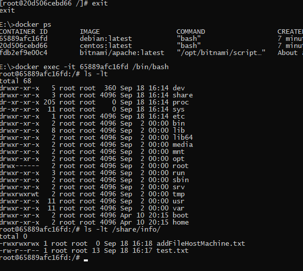

## 5.3. Контейнеризация на примере Docker

#### 1) Посмотрите на сценарий ниже и ответьте на вопрос: "Подходит ли в этом сценарии использование докера? Или лучше подойдет виртуальная машина, физическая машина? Или возможны разные варианты?"

#### Детально опишите и обоснуйте свой выбор.

#### Сценарий:

+ #### Высоконагруженное монолитное java веб-приложение;
+ #### Go-микросервис для генерации отчетов;
+ #### Nodejs веб-приложение;
+ #### Мобильное приложение c версиями для Android и iOS;
+ #### База данных postgresql используемая, как кэш;
+ #### Шина данных на базе Apache Kafka;
+ #### Очередь для Logstash на базе Redis;
+ #### Elastic stack для реализации логирования продуктивного веб-приложения - три ноды elasticsearch, два logstash и две ноды kibana;
+ #### Мониторинг-стек на базе prometheus и grafana;
+ #### Mongodb, как основное хранилище данных для java-приложения;
+ #### Jenkins-сервер.

**Ответ:**

* *Высоконагруженное монолитное java веб-приложение;*
  
    Здесь, требуется производительность и скорость - железный сервер


* *Go-микросервис для генерации отчетов;*

  Web сервис, идеально для docker


* *Nodejs веб-приложение;*

    Web приложение, идеально для docker


* *Мобильное приложение c версиями для Android и iOS;*

  Под данные требования необходима виртуализация

  
* *База данных postgresql используемая, как кэш;*

  Здесь, требуется производительность и скорость - железный сервер

  
* *Шина данных на базе Apache Kafka;*

    Контейнеры уместна при небольших масштабах проекта
  

* *Очередь для Logstash на базе Redis;*
  ИСпользуем СУБД - при высокой нагрузки лучше железный сервер, для не больших задач можно установить виртуалку


* *Elastic stack для реализации логирования продуктивного веб-приложения - три ноды elasticsearch, два logstash и две ноды kibana;*

  Elasticsearсh можно на виртуалку в кластер, kibana и logstash в docker


* *Мониторинг-стек на базе prometheus и grafana;*

    Думаю что можно использовать docker. Нагрузка не должна быть высокой, в дальнейшем удобно обновлять, добавлять различные модули.
 
 
* *Mongodb, как основное хранилище данных для java-приложения;*
  Виртуальная машина самый оптимальный выбор


* *Jenkins-сервер.*

  Сервер разработки, возможно использовать в docker.

#### 2) Сценарий выполения задачи:

+ #### создайте свой репозиторий на докерхаб;
+ #### выберете любой образ, который содержит апачи веб-сервер;
+ #### создайте свой форк образа;
+ #### реализуйте функциональность: запуск веб-сервера в фоне с индекс-страницей, содержащей HTML-код ниже:
```html
<html>
    <head>
        Hey, Netology
    </head>
    <body>
        <h1>I’m kinda DevOps now</h1>
    </body>
</html>
```
+ #### Опубликуйте созданный форк в своем репозитории и предоставьте ответ в виде ссылки на докерхаб-репо.

**Ответ:**

+ Зарегистрировался на Docker Hub
+ Создал файл `index.html` с указанным содержимым и сохранил его по данному пути `E:\test`
+ Для тестов выбрал образ `bitnami/apache`
+ Запустил команду `docker run --name apache -v E:\test:/app -p 8080:8080 bitnami/apache:latest`

<span style="display:block;text-align:center"></span>

+ Результат в браузере

<span style="display:block;text-align:center"></span>

+ Делаем форк и пуш в репозиторий

<span style="display:block;text-align:center"></span>

+ Ссылка на репозиторий https://hub.docker.com/repository/docker/galtsev001/galtsev001

#### 3) Запустите первый контейнер из образа centos c любым тэгом в фоновом режиме, подключив папку info из текущей рабочей директории на хостовой машине в /share/info контейнера;
#### Запустите второй контейнер из образа debian:latest в фоновом режиме, подключив папку info из текущей рабочей директории на хостовой машине в /info контейнера;
#### Подключитесь к первому контейнеру с помощью exec и создайте текстовый файл любого содержания в /share/info ;
#### Добавьте еще один файл в папку info на хостовой машине;
#### Подключитесь во второй контейнер и отобразите листинг и содержание файлов в /info контейнера

**Ответ**

+ Делаем pull centos & debian

<span style="display:block;text-align:center"></span>

+ Запускаем первый контейнер Centos и Debian

<span style="display:block;text-align:center"></span>

+ Подключаемся к Centos с помощью команды `exec`

<span style="display:block;text-align:center"></span>

+ Добавляем файл на хостовой машине 

<span style="display:block;text-align:center"></span>
<span style="display:block;text-align:center"></span>

+ Подключитесь во второй контейнер и отобразите листинг и содержание файлов в /info контейнера

<span style="display:block;text-align:center"></span>
