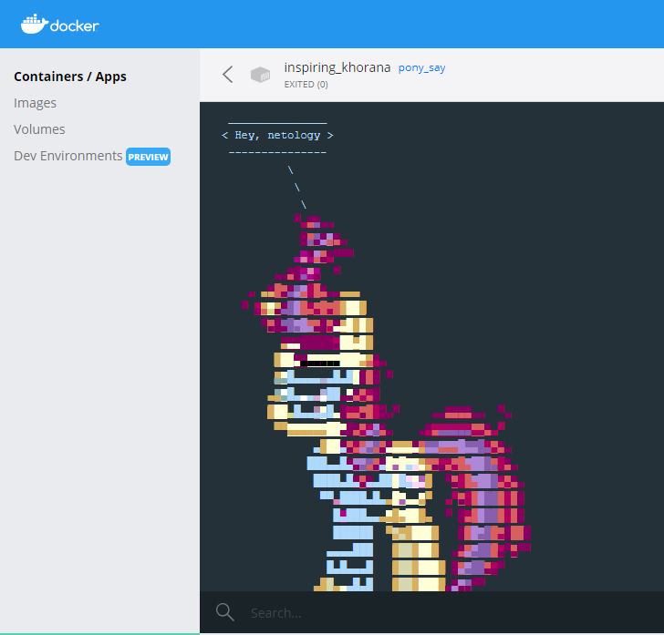

## 5.4. Практические навыки работы с Docker

#### 1) В данном задании вы научитесь изменять существующие Dockerfile, адаптируя их под нужный инфраструктурный стек.

#### Измените базовый образ предложенного Dockerfile на Arch Linux c сохранением его функциональности.

```bash
FROM ubuntu:latest

RUN apt-get update && \
apt-get install -y software-properties-common && \
add-apt-repository ppa:vincent-c/ponysay && \
apt-get update

RUN apt-get install -y ponysay

ENTRYPOINT ["/usr/bin/ponysay"]
CMD ["Hey, netology”]
```

#### Для получения зачета, вам необходимо предоставить:

+ #### Написанный вами Dockerfile
+ #### Скриншот вывода командной строки после запуска контейнера из вашего базового образа
+ #### Ссылку на образ в вашем хранилище docker-hub

**Ответ:**

+ [Dockerfile](./config/1/Dockerfile)
+ Сборка и запуск

<span style="display:block;text-align:center"></span>

+ Результат

<span style="display:block;text-align:center"></span>

+ `docker pull galtsev001/galtsev001:homework-5-4`

___

#### 2) В данной задаче вы составите несколько разных Dockerfile для проекта Jenkins, опубликуем образ в dockerhub.io и посмотрим логи этих контейнеров.

+ #### Составьте 2 Dockerfile:
    + #### Общие моменты:
      + #### Образ должен запускать Jenkins server
    + #### Спецификация первого образа:
      + #### Базовый образ - amazoncorreto
      + #### Присвоить образу тэг ver1
    + #### Спецификация второго образа:
      + #### Базовый образ - ubuntu:latest
      + #### Присвоить образу тэг ver2
+ #### Соберите 2 образа по полученным Dockerfile
+ #### Запустите и проверьте их работоспособность
+ #### Опубликуйте образы в своём dockerhub.io хранилище
#### Для получения зачета, вам необходимо предоставить:
+ #### Наполнения 2х Dockerfile из задания
+ #### Скриншоты логов запущенных вами контейнеров (из командной строки)
+ #### Скриншоты веб-интерфейса Jenkins запущенных вами контейнеров (достаточно 1 скриншота на контейнер)
+ #### Ссылки на образы в вашем хранилище docker-hub

**Ответ:**

+ Установим необходимые образы

<span style="display:block;text-align:center"></span>

+ Создадим необходимые Dockerfile
  + [a_ver1](./config/2/a_ver1)
  + [u_ver1](./config/2/u_ver1)
+ Запускаем сервисы
```bash
docker build -t galtsev001/galtsev001:ver1 -f a_ver1 .  
docker run -p 8085:8080 -p 50005:50000 -w /usr/lib/jenkins/ -i -t galtsev001/galtsev001:ver1 java -jar jenkins.war  

docker build -t galtsev001/galtsev001:ver2 -f u_ver2 .  
docker run -p 8086:8080 -p 50006:50000 -w /usr/share/jenkins/ -i -t galtsev001/galtsev001:ver2 java -jar jenkins.war 
```
<span style="display:block;text-align:center"></span>

+ Веб страница 

<span style="display:block;text-align:center"></span>

+ Docker Hub

```html
docker pull galtsev001/galtsev001:ver1

docker pull galtsev001/galtsev001:ver2
```
___

#### 3) В данном задании вы научитесь:
+ #### объединять контейнеры в единую сеть
+ #### исполнять команды "изнутри" контейнера
#### Для выполнения задания вам нужно:
+ #### Написать Dockerfile:
  + #### Использовать образ https://hub.docker.com/_/node как базовый
  + #### Установить необходимые зависимые библиотеки для запуска npm приложения https://github.com/simplicitesoftware/nodejs-demo
  + #### Выставить у приложения (и контейнера) порт 3000 для прослушки входящих запросов
+ #### Соберите образ и запустите контейнер в фоновом режиме с публикацией порта
+ #### Запустить второй контейнер из образа ubuntu:latest
+ #### Создайть docker network и добавьте в нее оба запущенных контейнера
#### Используя docker exec запустить командную строку контейнера ubuntu в интерактивном режиме
+ #### Используя утилиту curl вызвать путь / контейнера с npm приложением
#### получения зачета, вам необходимо предоставить:
+ #### Наполнение Dockerfile с npm приложением
+ #### Скриншот вывода вызова команды списка docker сетей (docker network cli)
+ #### Скриншот вызова утилиты curl с успешным ответом

**Ответ:**

+ Подтягиваем необходимый образ `docker pull node:latest`
+ Создаем докер файл
  + [Dockerfile](,/config/3/nodejs_example)
+ Забилдим наш сборку
  <span style="display:block;text-align:center"></span>
+ Далее необходимо создать сетевое пространство:
  <span style="display:block;text-align:center"></span>
+ Запускаем контейнер
  <span style="display:block;text-align:center"></span>
+ Запустим еще один контейнер и подключимся к тестовому `nodejs`
```bash
docker run -it --net=nodejs-demo ubuntu:latest bash
root@6fa2bd9bdfe7:/#apt-get update
root@6fa2bd9bdfe7:/#apt-get install curl
root@6fa2bd9bdfe7:/#curl 172.18.0.2:3000
```
+ Получаем такого рода ответ
  <span style="display:block;text-align:center"></span>

+ Сетевое подключение
  <span style="display:block;text-align:center"></span>

+ Docker Hub
```html
docker pull galtsev001/galtsev001:nodejs_example
```
__