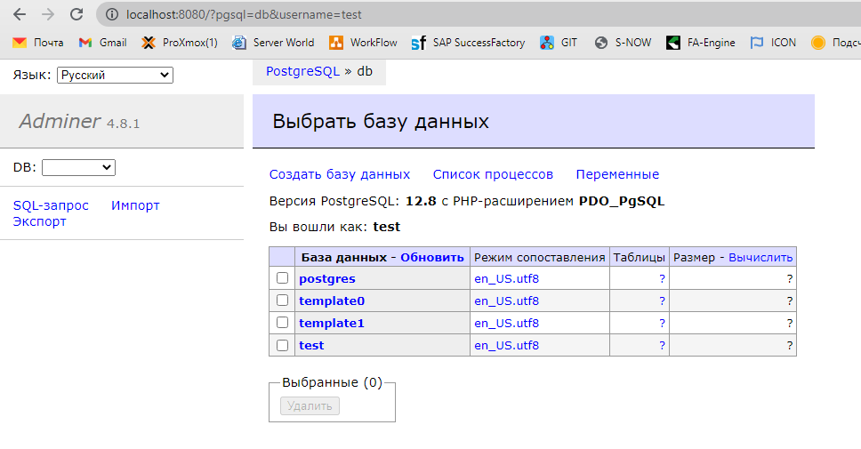
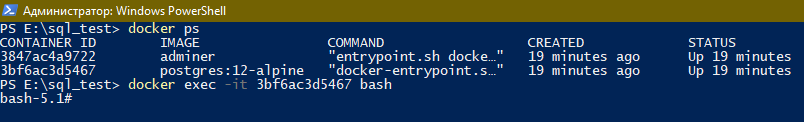
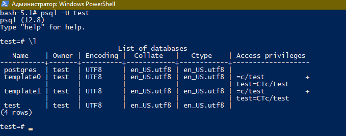
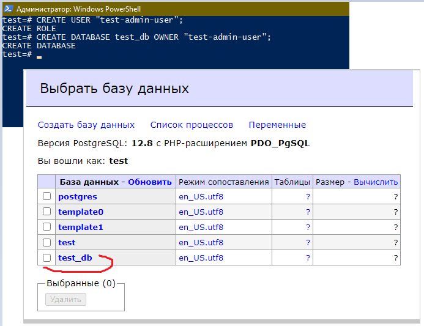
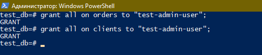
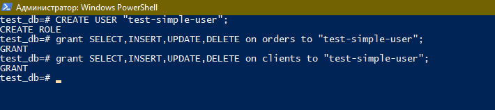
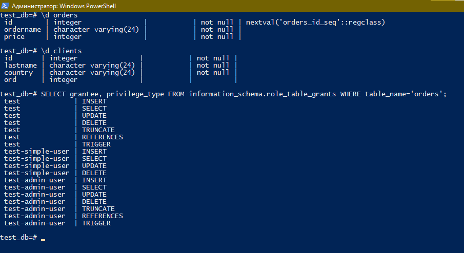

## 6.2. SQL

### Задача 1
#### Используя docker поднимите инстанс PostgreSQL (версию 12) c 2 volume, в который будут складываться данные БД и бэкапы.
#### Приведите получившуюся команду или docker-compose манифест.
___
**Ответ:**

Структура проекта:
```bash  
  db - папка для файлов БД
  docker-compose.yml - файл-инструкция для Docker
```
+ Файл `docker-compose.yml`
  + [docker-compose.yml](./config/docker-compose.yml)
+ Подключил `adminer` для удобного просмотра данных в БД
  <span style="display:block;text-align:center"></span>

___
### Задача 2
#### В БД из задачи 1:

+ #### создайте пользователя test-admin-user и БД test_db
+ #### в БД test_db создайте таблицу orders и clients (спeцификация таблиц ниже)
+ #### предоставьте привилегии на все операции пользователю test-admin-user на таблицы БД test_db
+ #### создайте пользователя test-simple-user
+ #### предоставьте пользователю test-simple-user права на SELECT/INSERT/UPDATE/DELETE данных таблиц БД test_db
#### Таблица `orders:`
+ #### id (serial primary key)
+ #### наименование (string)
+ #### цена (integer)
#### Таблица `clients`:
+ #### id (serial primary key)
+ #### фамилия (string)
+ #### страна проживания (string, index)
+ #### заказ (foreign key orders)
#### Приведите:
+ #### итоговый список БД после выполнения пунктов выше,
+ #### описание таблиц (describe)
+ #### SQL-запрос для выдачи списка пользователей с правами над таблицами test_db
+ #### список пользователей с правами над таблицами test_db
___
**Ответ:**
+ Проверяем списки контейнеров и подключаемся к `postgres`
 

  <span style="display:block;text-align:center"></span>
+ Запускаем `psql` и проверяем список БД
 

  <span style="display:block;text-align:center"></span>
+ Создаем `test-admin-user` и БД `test_db` + даем все права создаваемому пользователю
 

  <span style="display:block;text-align:center"></span>
  <span style="display:block;text-align:center"></span>
+ Создаем таблицы

```html
#Подключаемся к созданой базе данных
\c test_db;

#Создаем таблицу orders
CREATE TABLE orders(
	id	serial PRIMARY KEY,  
	ordername	varchar(24) NOT NULL,  
	price	integer NOT NULL  
  );

#Создаем таблицу clients	
CREATE TABLE clients(
	id	integer PRIMARY KEY,
	lastname	varchar(24) NOT NULL,
	country	varchar(24) NOT NULL,
    	ord integer REFERENCES orders(id)
  );
```
+ Cоздаем пользователя `test-simple-user` и даем требуемые права на таблицы

  <span style="display:block;text-align:center"></span>

+ Покажем всю статистику по созданной БД и пользователям

  <span style="display:block;text-align:center"></span>

___
### Задача 3
#### Используя SQL синтаксис - наполните таблицы следующими тестовыми данными:
#### Таблица `orders`
| Наименование 	| Цена 	|
|:------------:	|:----:	|
|    Шоколад   	|  10  	|
|    Принтер   	| 3000 	|
|     Книга    	|  500 	|
|    Монитор   	| 7000 	|
|    Гитара    	| 4000 	|

#### Таблица `clients`
|          ФИО         	| Страна проживания 	|
|:--------------------:	|:-----------------:	|
| Иванов Иван Иванович 	|        USA        	|
| Петров Петр Петрович 	|       Canada      	|
| Иоганн Себастьян Бах 	|       Japan       	|
| Ронни Джеймс Дио     	|       Russia      	|
| Ritchie Blackmore    	|       Russia      	|
#### Используя SQL синтаксис:

* #### вычислите количество записей для каждой таблицы
* #### приведите в ответе:
  * #### запросы
  * #### результаты их выполнения.
___
**Ответ:**

___
### Задача 4
#### Часть пользователей из таблицы clients решили оформить заказы из таблицы orders.
#### Используя foreign keys свяжите записи из таблиц, согласно таблице:
|          ФИО         	|  Заказ  	|
|:--------------------:	|:-------:	|
| Иванов Иван Иванович 	|  Книга  	|
| Петров Петр Петрович 	| Монитор 	|
| Иоганн Себастьян Бах 	|  Гитара 	|
#### Приведите SQL-запросы для выполнения данных операций.
#### Приведите SQL-запрос для выдачи всех пользователей, которые совершили заказ, а также вывод данного запроса.
#### Подсказк - используйте директиву `UPDATE.`
___
**Ответ:**

___
### Задача 5
#### Получите полную информацию по выполнению запроса выдачи всех пользователей из задачи 4 (используя директиву EXPLAIN).
#### Приведите получившийся результат и объясните что значат полученные значения.
___
**Ответ:**

___
### Задача 6
#### Создайте бэкап БД test_db и поместите его в volume, предназначенный для бэкапов (см. Задачу 1).
#### Остановите контейнер с PostgreSQL (но не удаляйте volumes).
#### Поднимите новый пустой контейнер с PostgreSQL.
#### Восстановите БД test_db в новом контейнере.
#### Приведите список операций, который вы применяли для бэкапа данных и восстановления.
___
**Ответ:**

___
