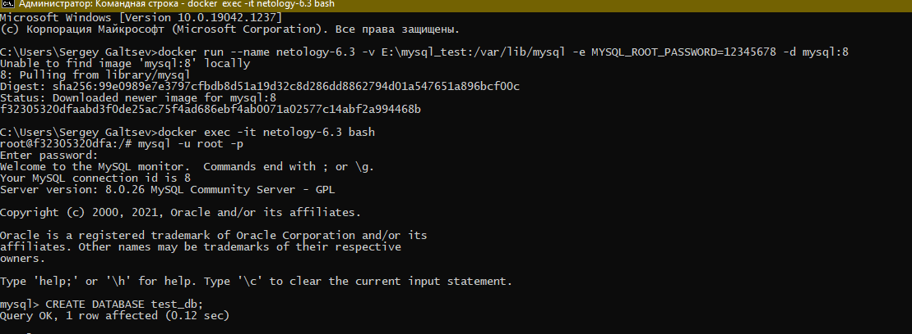
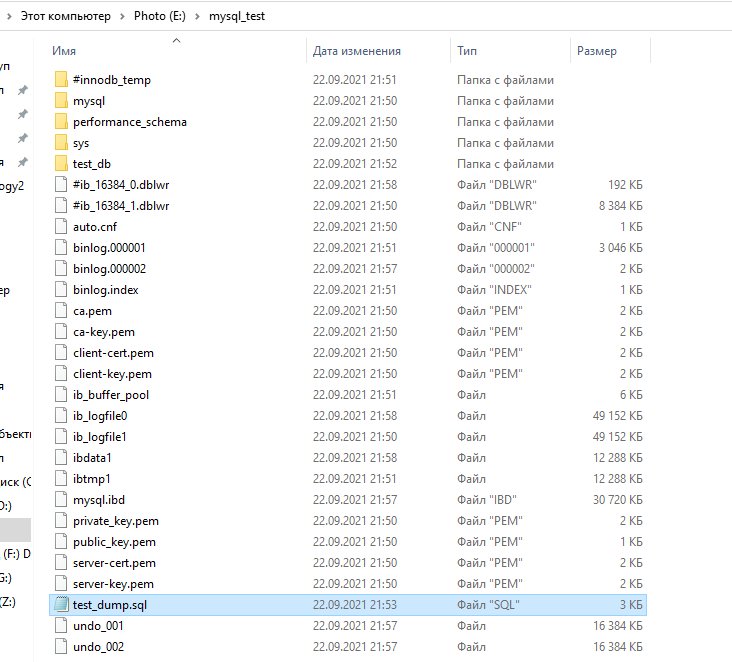
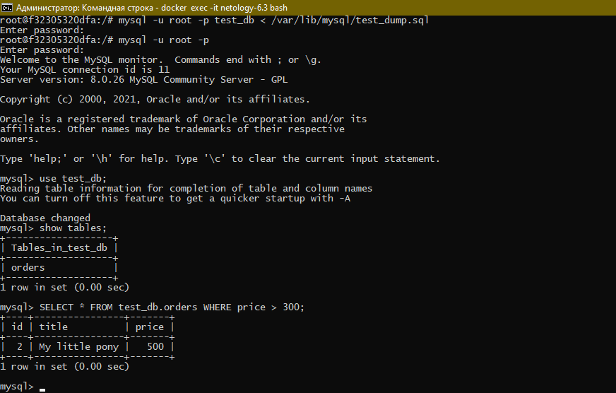
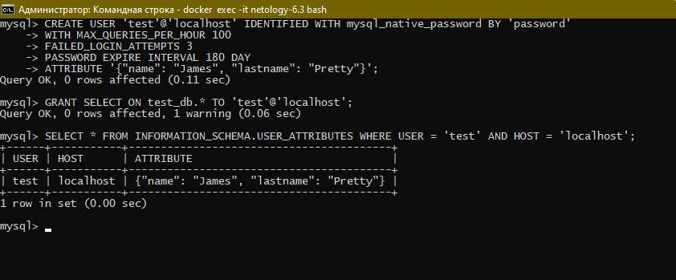
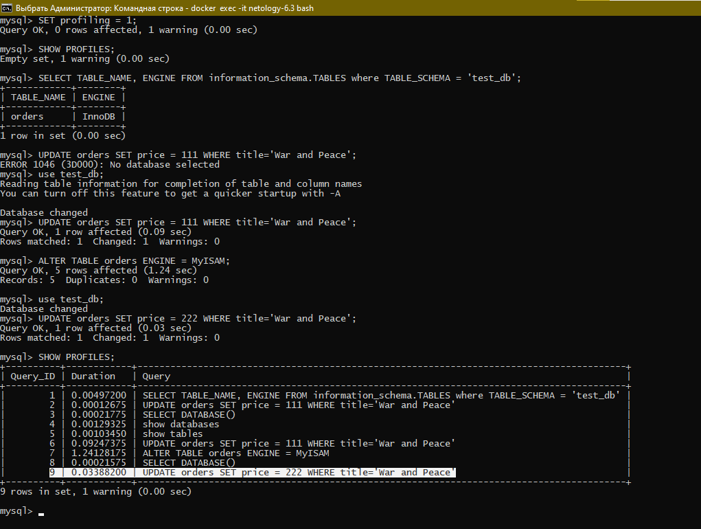
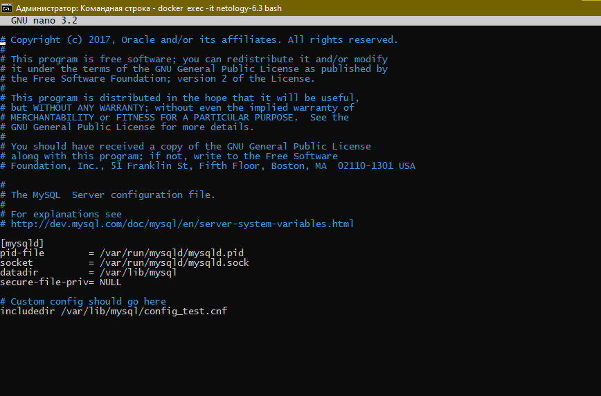

## 6.3. MySQL

#### 1) Используя docker поднимите инстанс MySQL (версию 8). Данные БД сохраните в volume.

#### Изучите бэкап БД и восстановитесь из него.

#### Перейдите в управляющую консоль mysql внутри контейнера.

#### Используя команду \h получите список управляющих команд.

#### Найдите команду для выдачи статуса БД и приведите в ответе из ее вывода версию сервера БД.

#### Подключитесь к восстановленной БД и получите список таблиц из этой БД.

#### Приведите в ответе количество записей с price > 300.

#### В следующих заданиях мы будем продолжать работу с данным контейнером.

**Ответ:**

+ Создаем контейнер требуемой конфигурации

  

+ Копируем бэкап в расшаренную папку

  

+ Восстанавливаемся и делаем требуемые запросы

  

#### 2) Создайте пользователя test в БД c паролем test-pass, используя:

+ #### плагин авторизации mysql_native_password
+ #### срок истечения пароля - 180 дней
+ #### количество попыток авторизации - 3
+ #### максимальное количество запросов в час - 100
+ #### аттрибуты пользователя:
+ #### Фамилия "Pretty"
+ #### Имя "James"
#### Предоставьте привелегии пользователю test на операции SELECT базы test_db.

#### Используя таблицу INFORMATION_SCHEMA.USER_ATTRIBUTES получите данные по пользователю test и приведите в ответе к задаче.

**Ответ:**

#### 3) Установите профилирование SET profiling = 1. Изучите вывод профилирования команд SHOW PROFILES;.

#### Исследуйте, какой engine используется в таблице БД test_db и приведите в ответе.

#### Измените engine и приведите время выполнения и запрос на изменения из профайлера в ответе:

+ #### на MyISAM
+ #### на InnoDB

**Ответ:**

Как видно из примера выше MyISAM отработал быстрее

#### 4) Изучите файл my.cnf в директории /etc/mysql.

#### Измените его согласно ТЗ (движок InnoDB):

+ #### Скорость IO важнее сохранности данных
+ #### Нужна компрессия таблиц для экономии места на диске
+ #### Размер буффера с незакомиченными транзакциями 1 Мб
+ #### Буффер кеширования 30% от ОЗУ
+ #### Размер файла логов операций 100 Мб
#### Приведите в ответе измененный файл my.cnf

**Ответ:**

+ Создадим файл конфигурации 

[config_test.cnf](./config/config_test.cnf)

+ Сохраним его в нашей расшаренной папке
+ В главном конфиге mysql подключим его

