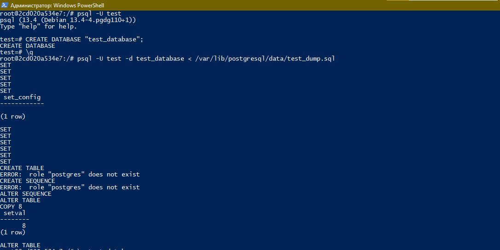

## 6.4. PostgreSQL

### Задача 1
#### Используя docker поднимите инстанс PostgreSQL (версию 13). Данные БД сохраните в volume.
#### Подключитесь к БД PostgreSQL используя psql.
#### Воспользуйтесь командой \? для вывода подсказки по имеющимся в psql управляющим командам.

#### Найдите и приведите управляющие команды для:

+ #### вывода списка БД
+ #### подключения к БД
+ #### вывода списка таблиц
+ #### вывода описания содержимого таблиц
+ #### выхода из psql
___
**Ответ:**
[Docker-Compose File](./config/docker-compose.yml)
<span style="display:block;text-align:center"></span>

+ вывода списка БД

`\l`
+ подключения к БД

`\c <название БД>`
+ вывода списка таблиц

`\dt`
+ вывода описания содержимого таблиц

`\d <название таблиц>`
+ выхода из psql

`\q`
___
### Задача 2
#### Используя psql создайте БД test_database.
#### Изучите бэкап БД.
#### Восстановите бэкап БД в test_database.
#### Перейдите в управляющую консоль psql внутри контейнера.
#### Подключитесь к восстановленной БД и проведите операцию ANALYZE для сбора статистики по таблице.
#### Используя таблицу pg_stats, найдите столбец таблицы orders с наибольшим средним значением размера элементов в байтах.
#### Приведите в ответе команду, которую вы использовали для вычисления и полученный результат.
___
**Ответ:**
<span style="display:block;text-align:center"></span>
<span style="display:block;text-align:center"></span>

__
### Задача 3
#### Архитектор и администратор БД выяснили, что ваша таблица orders разрослась до невиданных размеров и поиск по ней занимает долгое время. Вам, как успешному выпускнику курсов DevOps в нетологии предложили провести разбиение таблицы на 2 (шардировать на orders_1 - price>499 и orders_2 - price<=499).
#### Предложите SQL-транзакцию для проведения данной операции.
#### Можно ли было изначально исключить "ручное" разбиение при проектировании таблицы orders?
___
**Ответ:**

+ #### Создаем новую таблицу с использование дополнительной синтаксической конструкции в команде CREATE ТABLE – PATITION BY.
```
test_database=# CREATE TABLE orders_range (
id INT,
title varchar (80),
price INT ) PARTITION BY RANGE(price);
CREATE TABLE
```
+ #### шардируем получившуюся таблицу
```
test_database=# CREATE TABLE orders_1 PARTITION OF orders_range FOR VALUES FROM  (499) TO (9999999);
CREATE TABLE
test_database=# CREATE TABLE orders_2 PARTITION OF orders_range FOR VALUES FROM  (0) TO (499);
CREATE TABLE
```

+ #### Вставляем содержимое таблиц orders в orders_range
```
test_database=# INSERT INTO orders_range SELECT * FROM orders;
INSERT 0 8
```
___
### Задача 4
#### Используя утилиту pg_dump создайте бекап БД test_database.
#### Как бы вы доработали бэкап-файл, чтобы добавить уникальность значения столбца title для таблиц test_database?
___
**Ответ:**
<span style="display:block;text-align:center"></span>
***Как бы вы доработали бэкап-файл, чтобы добавить уникальность значения столбца title для таблиц test_database?***
```html
-- нужно добавить ключевое слово UNIQUE к нужному столбцу
--
-- Name: orders; Type: TABLE; Schema: public; Owner: postgres
--

CREATE TABLE public.orders (
    id integer NOT NULL,
    title character varying(80) UNIQUE NOT NULL,
    price integer DEFAULT 0
);
```
____