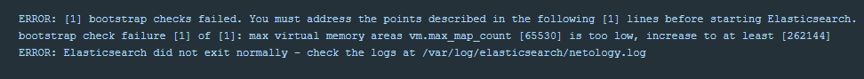

## 6.5. Elasticsearch

### Задача 1
В этом задании вы потренируетесь в:

+ установке elasticsearch
+ первоначальном конфигурировании elastcisearch
+ запуске elasticsearch в docker
+ 
Используя докер образ centos:7 как базовый и документацию по установке и запуску Elastcisearch:

+ составьте Dockerfile-манифест для elasticsearch
+ соберите docker-образ и сделайте push в ваш docker.io репозиторий
+ запустите контейнер из получившегося образа и выполните запрос пути / c хост-машины

Требования к elasticsearch.yml:
+ данные path должны сохраняться в /var/lib
+ имя ноды должно быть netology_test

В ответе приведите:

+ текст Dockerfile манифеста
+ ссылку на образ в репозитории dockerhub
+ ответ elasticsearch на запрос пути / в json виде
Подсказки:

+ возможно вам понадобится установка пакета perl-Digest-SHA для корректной работы пакета shasum
+ при сетевых проблемах внимательно изучите кластерные и сетевые настройки в elasticsearch.yml
+ при некоторых проблемах вам поможет docker директива ulimit
+ elasticsearch в логах обычно описывает проблему и пути ее решения
Далее мы будем работать с данным экземпляром elasticsearch.
___
**Ответ:**

Файлы для запуска elasticsearch находятся в [каталоге](./config)
При первом запуске появилась ошибка:
<span style="display:block;text-align:center"></span>
Ссылка на Docker Hub
https://hub.docker.com/layers/174356241/galtsev001/galtsev001/elastic/images/sha256-c5172a8f7de7b60a3ce4568cfa8467e1f5669be78bf1a736e93323cb143e19aa?context=repo
```html
docker pull galtsev001/galtsev001:elastic
```
<span style="display:block;text-align:center"></span>

___
### Задача 2
В этом задании вы научитесь:

+ создавать и удалять индексы
+ изучать состояние кластера
+ обосновывать причину деградации доступности данных

Ознакомитесь с документацией и добавьте в elasticsearch 3 индекса, в соответствии со таблицей:

Имя	Количество реплик	Количество шард
ind-1	0	1
ind-2	1	2
ind-3	2	4
Получите список индексов и их статусов, используя API и приведите в ответе на задание.

Получите состояние кластера elasticsearch, используя API.

Как вы думаете, почему часть индексов и кластер находится в состоянии yellow?

Удалите все индексы.

**Важно**

При проектировании кластера elasticsearch нужно корректно рассчитывать количество реплик и шард, иначе возможна потеря данных индексов, вплоть до полной, при деградации системы.
___
**Ответ:**
 + Создаем индексы  - 3 шт

   <span style="display:block;text-align:center"></span>

 + Получаем список индексов

   <span style="display:block;text-align:center"></span>

 + Статус yellow у индекса - обозначает что нода одна.

   <span style="display:block;text-align:center"></span>

 + Индексы удаляем командой
   `curl -X DELETE "localhost:9200/_all?pretty"`

___
### Задача 3
В данном задании вы научитесь:

+ создавать бэкапы данных
+ восстанавливать индексы из бэкапов

Создайте директорию {путь до корневой директории с elasticsearch в образе}/snapshots.

Используя API зарегистрируйте данную директорию как snapshot repository c именем netology_backup.

Приведите в ответе запрос API и результат вызова API для создания репозитория.

Создайте индекс test с 0 реплик и 1 шардом и приведите в ответе список индексов.

Создайте snapshot состояния кластера elasticsearch.

Приведите в ответе список файлов в директории со snapshotами.

Удалите индекс test, и создайте индекс test-2. Приведите в ответе список индексов.

Восстановите состояние кластера elasticsearch из snapshot, созданного ранее.

Приведите в ответе запрос к API восстановления и итоговый список индексов.

Подсказки:

+ возможно вам понадобится доработать elasticsearch.yml в части директивы path.repo и перезапустить elasticsearch
___
**Ответ:**

+ регистрируем репозиторий для спапшотов
  <span style="display:block;text-align:center"></span>


+ создание индекса и список индексов
  <span style="display:block;text-align:center"></span>


+ создаем снапшот командой
  curl -X PUT "localhost:9200/_snapshot/netology_backup/snapshot_cluster?wait_for_completion=true&pretty"
  и выводим список файлов в каталоге со снапшотами
  `docker exec -it elasticsearch ls -l /var/lib/elasticsearch/snapshots`
  <span style="display:block;text-align:center"></span>


+ удаление индекса
  curl -X DELETE "localhost:9200/test?pretty"
  создание нового индекса и отображение списка индексов

  <span style="display:block;text-align:center"></span>

+ восстановление индекса из снапшота
  curl -X POST "localhost:9200/_snapshot/netology_backup/snapshot_cluster/_restore?pretty"
  и список индексови список индексов

  <span style="display:block;text-align:center"></span>


___