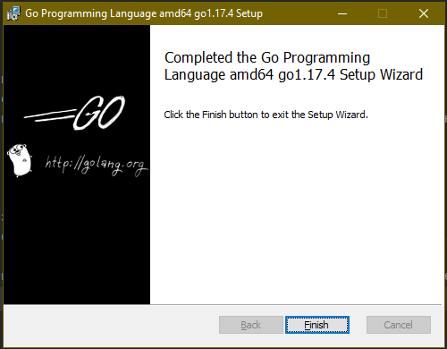

# Домашнее задание к занятию "7.5. Основы golang"

С `golang` в рамках курса, мы будем работать не много, поэтому можно использовать любой IDE.
Но рекомендуем ознакомиться с [GoLand](https://www.jetbrains.com/ru-ru/go/).

## Задача 1. Установите golang.
1. Воспользуйтесь инструкций с официального сайта: [https://golang.org/](https://golang.org/).
2. Так же для тестирования кода можно использовать песочницу: [https://play.golang.org/](https://play.golang.org/).
___
**Ответ**




## Задача 2. Знакомство с gotour.
У Golang есть обучающая интерактивная консоль [https://tour.golang.org/](https://tour.golang.org/).
Рекомендуется изучить максимальное количество примеров. В консоли уже написан необходимый код,
осталось только с ним ознакомиться и поэкспериментировать как написано в инструкции в левой части экрана.
___
**Ответ**


## Задача 3. Написание кода.
Цель этого задания закрепить знания о базовом синтаксисе языка. Можно использовать редактор кода
на своем компьютере, либо использовать песочницу: [https://play.golang.org/](https://play.golang.org/).

1. Напишите программу для перевода метров в футы (1 фут = 0.3048 метр). Можно запросить исходные данные
   у пользователя, а можно статически задать в коде.
   Для взаимодействия с пользователем можно использовать функцию `Scanf`:
    ```
    package main
    
    import "fmt"
    
    func main() {
        fmt.Print("Enter a number: ")
        var input float64
        fmt.Scanf("%f", &input)
    
        output := input * 2
    
        fmt.Println(output)    
    }
    ```

1. Напишите программу, которая найдет наименьший элемент в любом заданном списке, например:
    ```
    x := []int{48,96,86,68,57,82,63,70,37,34,83,27,19,97,9,17,}
    ```
1. Напишите программу, которая выводит числа от 1 до 100, которые делятся на 3. То есть `(3, 6, 9, …)`.

В виде решения ссылку на код или сам код.
___
**Ответ**

+ Программа футы

```
package main
import "fmt"
func main() {
    fmt.Print("Enter a number: ")
    var number float64
    fmt.Scanf("%f", &number)
    output := number * 0.3048
    fmt.Println(output)
}

```

+ Программа поиска наименьшего элемента

```
package main
import "fmt"
func main() {
	array := []int{48,96,86,68,57,82,63,70,37,34,83,27,19,97,9,17,}
 	minNum := array[0]
 	for _, element := range array {
		if element < minNum {
			minNum = element
		}
	}
	fmt.Println("Minimal number:", minNum)
}
```

+ Программа выводит числа от 1 до 100, которые делятся на 3

```
package main
import "fmt"
func main() {
    for t := 1; t < 100; t++ {
        if t %3 == 0 {
            fmt.Println(t)
        }
    }
}
```
---

