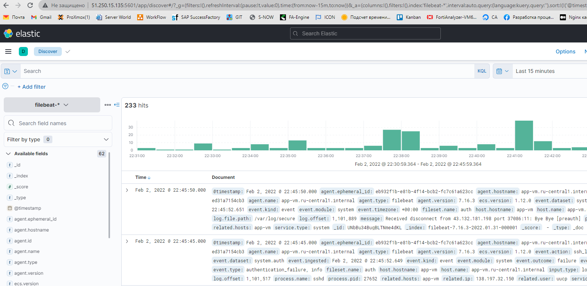

# Домашнее задание к занятию "08.03 Использование Yandex Cloud"

## Подготовка к выполнению
1. Создайте свой собственный (или используйте старый) публичный репозиторий на github с произвольным именем.
2. Скачайте [playbook](./playbook/) из репозитория с домашним заданием и перенесите его в свой репозиторий.

## Основная часть
1. Допишите playbook: нужно сделать ещё один play, который устанавливает и настраивает kibana.
2. При создании tasks рекомендую использовать модули: `get_url`, `template`, `yum`, `apt`.
3. Tasks должны: скачать нужной версии дистрибутив, выполнить распаковку в выбранную директорию, сгенерировать конфигурацию с параметрами.
4. Приготовьте свой собственный inventory файл `prod.yml`.
5. Запустите `ansible-lint site.yml` и исправьте ошибки, если они есть.
6. Попробуйте запустить playbook на этом окружении с флагом `--check`.
7. Запустите playbook на `prod.yml` окружении с флагом `--diff`. Убедитесь, что изменения на системе произведены.
8. Повторно запустите playbook с флагом `--diff` и убедитесь, что playbook идемпотентен.
9. Проделайте шаги с 1 до 8 для создания ещё одного play, который устанавливает и настраивает filebeat.
10. Подготовьте README.md файл по своему playbook. В нём должно быть описано: что делает playbook, какие у него есть параметры и теги.
11. Готовый playbook выложите в свой репозиторий, в ответ предоставьте ссылку на него.

---

*Ответ*

+ Устанавливаем 3 виртуальные машины

  

+ Исправляем все ошибки и дописываем 2 play для установки/настройки kibana & filebeat

[PLAYBOOK](./playbook/)

+ Работа плейбука ниже:

+ Работа плейбука c параметром `--diff` ниже:

+ Вывод команды `ansible-lint site.yml

+ Скрин Kibana работающий в связки с elasticsearch + filebeat

