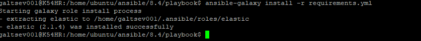
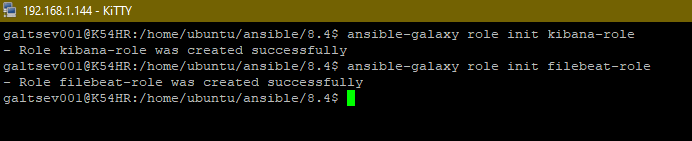
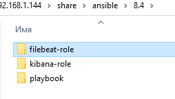
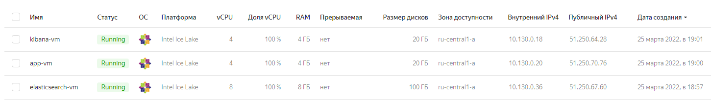
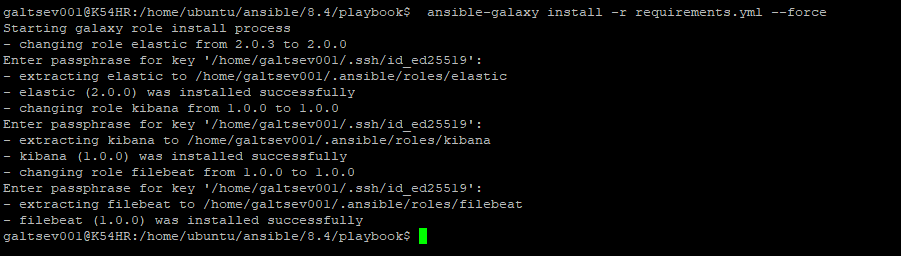
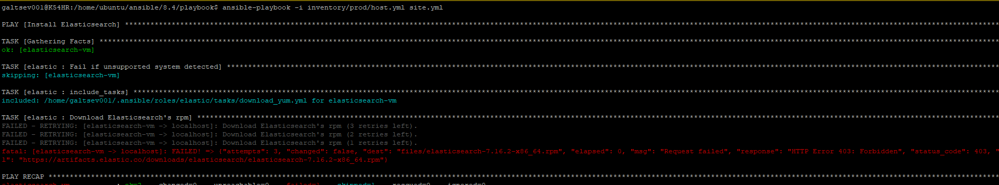
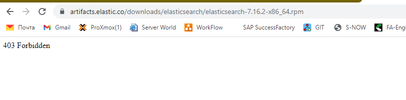

# Домашнее задание к занятию "8.4 Работа с Roles"

## Подготовка к выполнению
1. Создайте два пустых публичных репозитория в любом своём проекте: kibana-role и filebeat-role.
2. Добавьте публичную часть своего ключа к своему профилю в github.

## Основная часть

Наша основная цель - разбить наш playbook на отдельные roles. Задача: сделать roles для elastic, kibana, filebeat и написать playbook для использования этих ролей. Ожидаемый результат: существуют два ваших репозитория с roles и один репозиторий с playbook.

1. Создать в старой версии playbook файл `requirements.yml` и заполнить его следующим содержимым:
   ```yaml
   ---
     - src: git@github.com:netology-code/mnt-homeworks-ansible.git
       scm: git
       version: "2.0.0"
       name: elastic 
   ```
2. При помощи `ansible-galaxy` скачать себе эту роль.
3. Создать новый каталог с ролью при помощи `ansible-galaxy role init kibana-role`.
4. На основе tasks из старого playbook заполните новую role. Разнесите переменные между `vars` и `default`.
5. Перенести нужные шаблоны конфигов в `templates`.
6. Создать новый каталог с ролью при помощи `ansible-galaxy role init filebeat-role`.
7. На основе tasks из старого playbook заполните новую role. Разнесите переменные между `vars` и `default`.
8. Перенести нужные шаблоны конфигов в `templates`.
9. Описать в `README.md` обе роли и их параметры.
10. Выложите все roles в репозитории. Проставьте тэги, используя семантическую нумерацию.
11. Добавьте roles в `requirements.yml` в playbook.
12. Переработайте playbook на использование roles.
13. Выложите playbook в репозиторий.
14. В ответ приведите ссылки на оба репозитория с roles и одну ссылку на репозиторий с playbook.
___
*Ответ*

+ Создаем новую директорию `playbook`, где создаем файлик `requirements.yml`, добавляем требуемые строки для `elastic` и скачиваем роль
  

+ Параллельно создаем при помощи команды `ansible-galaxy role init` - две роли `kibana-role` и `filebeat-role`.
  




+ Перенесем все настройки с предыдущего задания 8.3 для наших ролей и выложим их в наш удаленный репозиторий `github`

[Kibana-role](https://github.com/galtsev001/kibana-role)

[Filebeat-role](https://github.com/galtsev001/filebeat-role)

+ Создадим vm на Yandex Cloud (старые машинки уже успел удалить)

  

+ Скачиваем все роли себе на компьютер

  

+ К сожалению, при попытке запустить плейбук выводит ошибку для Forbiden (невозможно скачать elasticsearch). Проверил на информацию на официальном сайте, там тоже не работает. Возможно, где-то в конфигурации плейбука есть ошибка, но не могу его задебажить тк на первом сразу ошибка :-(

Вывод ошибки в консоль

  

Ссылка в браузере

  

