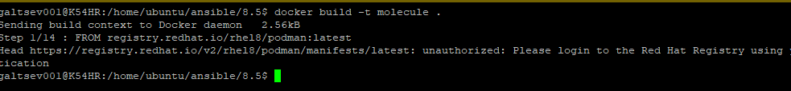
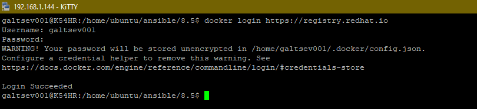
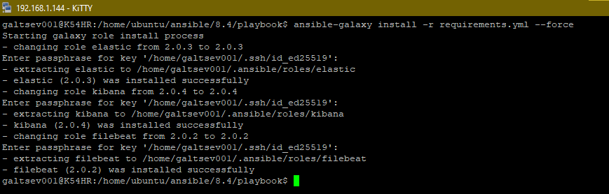
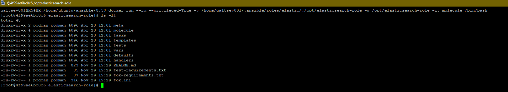
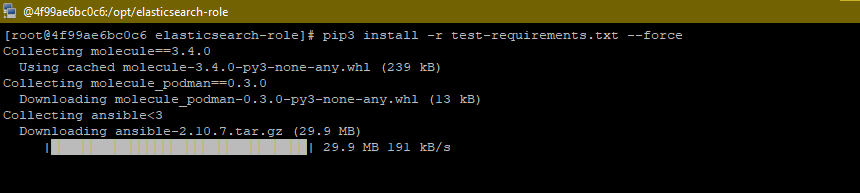
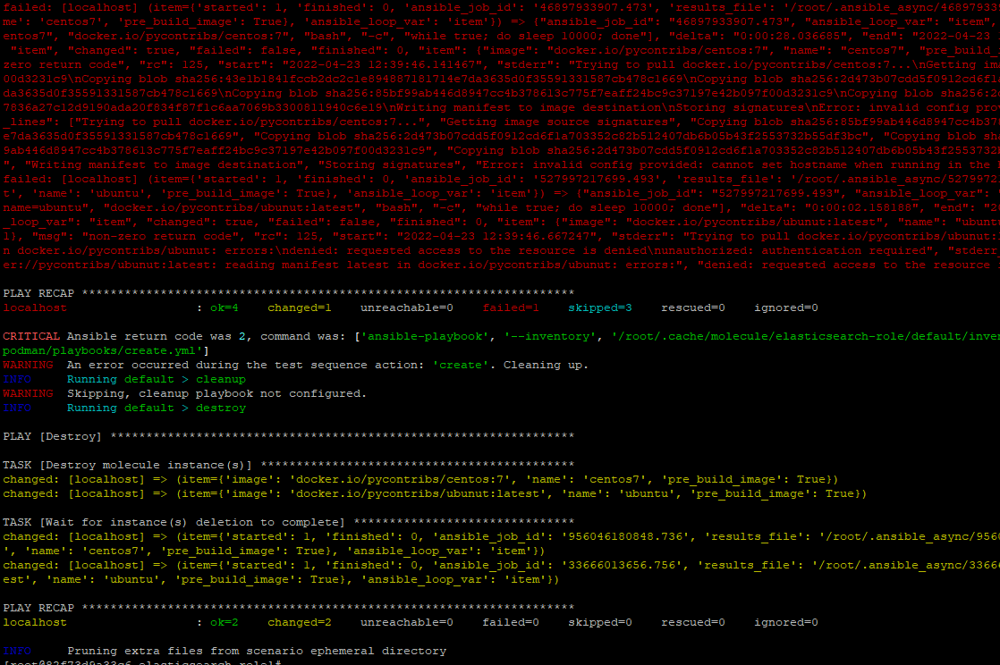
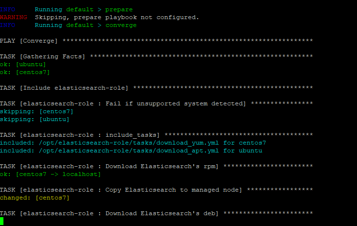
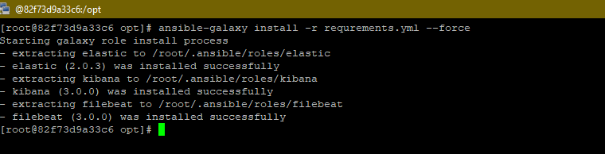
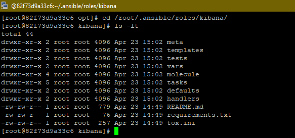
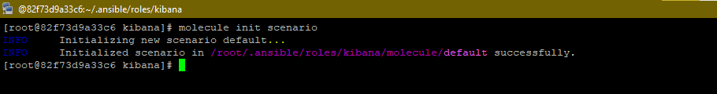

# Домашнее задание к занятию "08.05 Тестирование Roles"

## Подготовка к выполнению
1. Установите molecule: `pip3 install "molecule==3.4.0"`
2. Соберите локальный образ на основе [Dockerfile](./Dockerfile)

## Основная часть

Наша основная цель - настроить тестирование наших ролей. Задача: сделать сценарии тестирования для kibana, logstash. Ожидаемый результат: все сценарии успешно проходят тестирование ролей.

### Molecule

1. Запустите  `molecule test` внутри корневой директории elasticsearch-role, посмотрите на вывод команды.
2. Перейдите в каталог с ролью kibana-role и создайте сценарий тестирования по умолчаню при помощи `molecule init scenario --driver-name docker`.
3. Добавьте несколько разных дистрибутивов (centos:8, ubuntu:latest) для инстансов и протестируйте роль, исправьте найденные ошибки, если они есть.
4. Добавьте несколько assert'ов в verify.yml файл, для  проверки работоспособности kibana-role (проверка, что web отвечает, проверка логов, etc). Запустите тестирование роли повторно и проверьте, что оно прошло успешно.
5. Повторите шаги 2-4 для filebeat-role.
6. Добавьте новый тег на коммит с рабочим сценарием в соответствии с семантическим версионированием.
___
**Ответ:**

+ При попытке собрать контейнер из файла Dockerfile получаем следующее:



+ Перед началом чтобы запустить докер файл требуется регистрация `https://registry.redhat.io`. Регистрируемся 



+ Собираем образ

```bash
docker build -t molecule .
```
+ Изменим версию elasticsearch-role на 2.0.3 и обновим ее



+ Запустим собранный docker образ с указанием директории, где "живет" elasticsearch-role



+ Установим все зависимости, в том числе и molecule (file test-requirements.txt)



+ Сделаем `molecule test` и получаем ошибку. Podman пытается скачать образ ubunut:latest, а нужно ubuntu



+ В роле исправляем файлик molecule.yml и запускаем заново `molecule test` и не забываем включить VPN (выполнение таски скачивания elasticsearch)



+ Загружаем наши роли внутрь контейнера, я использовал файлик requremnts.yml + ansible-galaxy (предварительно подгрузив ключь внутрь контейнера для подключения по ssh)



+ переходим в категорию кибаны роли



+ Запускаем команду `molecule init scenario --driver-name docker`



+ Далее в созданной папке `molecule` прописываем соответствующие конфиги. Готовые работы выложены в github

[Kibana](https://github.com/galtsev001/kibana-role)

[FileBeat](https://github.com/galtsev001/filebeat-role)

### Tox

1. Запустите `docker run --privileged=True -v <path_to_repo>:/opt/elasticsearch-role -w /opt/elasticsearch-role -it <image_name> /bin/bash`, где path_to_repo - путь до корня репозитория с elasticsearch-role на вашей файловой системе.
2. Внутри контейнера выполните команду `tox`, посмотрите на вывод.
3. Добавьте файл `tox.ini` в корень репозитория каждой своей роли.
4. Создайте облегчённый сценарий для `molecule`. Проверьте его на исполнимость.
5. Пропишите правильную команду в `tox.ini` для того чтобы запускался облегчённый сценарий.
6. Запустите `docker` контейнер так, чтобы внутри оказались обе ваши роли.
7. Зайдти поочерёдно в каждую из них и запустите команду `tox`. Убедитесь, что всё отработало успешно.
8. Добавьте новый тег на коммит с рабочим сценарием в соответствии с семантическим версионированием.

После выполнения у вас должно получится два сценария molecule и один tox.ini файл в каждом репозитории. Ссылки на репозитории являются ответами на домашнее задание. Не забудьте указать в ответе теги решений Tox и Molecule заданий.
___

**Ответ:**

+ Выполненные шаги схожи с пунктом molecule, результаты работы выложены на github

[Kibana](https://github.com/galtsev001/kibana-role)

[FileBeat](https://github.com/galtsev001/filebeat-role)