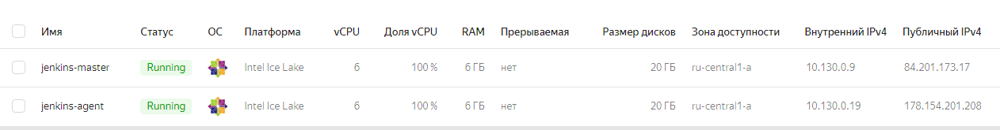
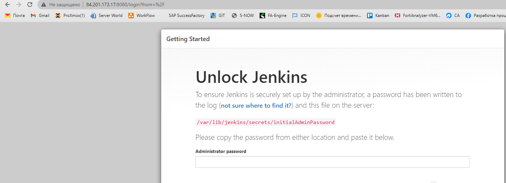
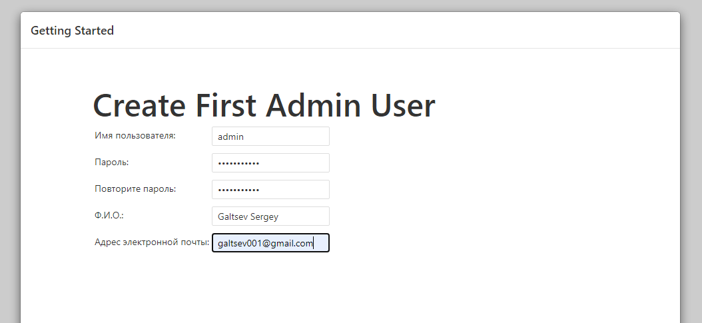
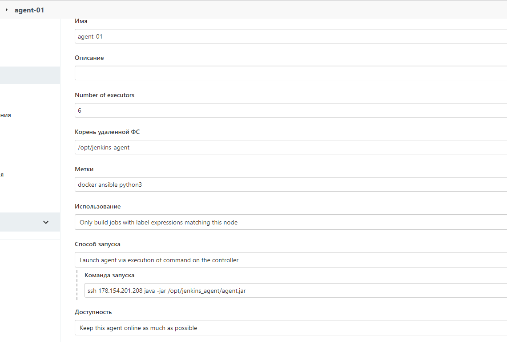
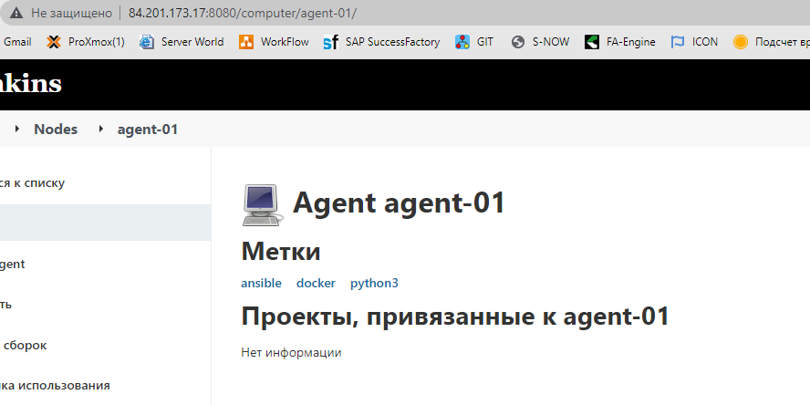
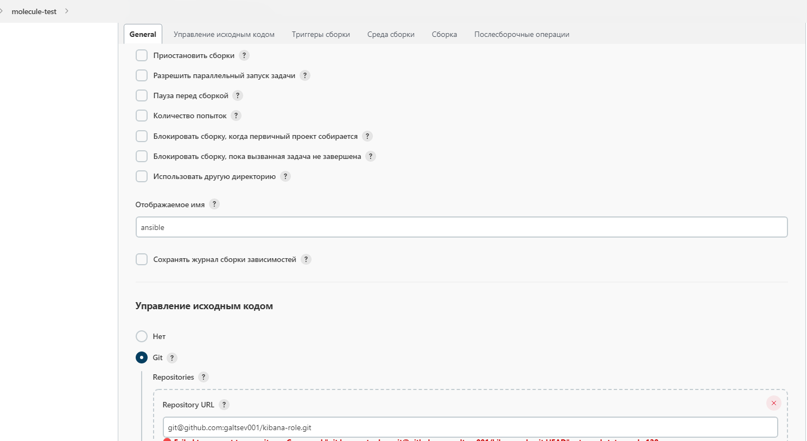
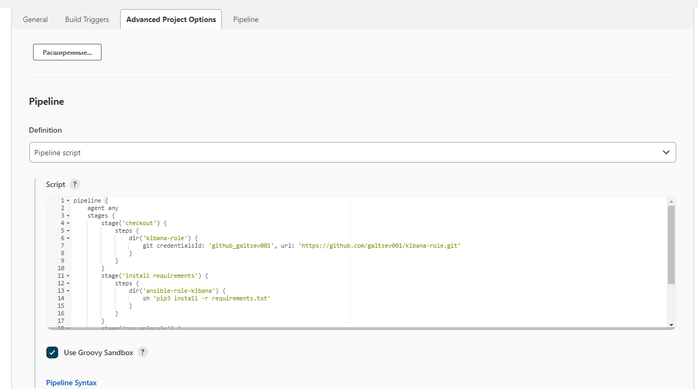
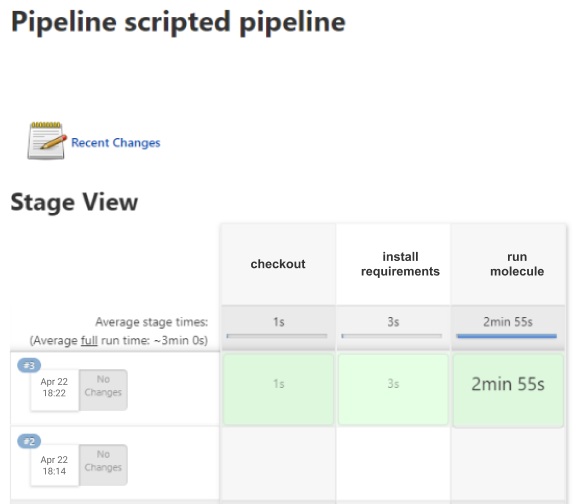

# Домашнее задание к занятию "09.04 Jenkins"

## Подготовка к выполнению

1. Создать 2 VM: для jenkins-master и jenkins-agent.
2. Установить jenkins при помощи playbook'a.
3. Запустить и проверить работоспособность.
4. Сделать первоначальную настройку.

## Основная часть

1. Сделать Freestyle Job, который будет запускать `molecule test` из любого вашего репозитория с ролью.
2. Сделать Declarative Pipeline Job, который будет запускать `molecule test` из любого вашего репозитория с ролью.
3. Перенести Declarative Pipeline в репозиторий в файл `Jenkinsfile`.
4. Создать Multibranch Pipeline на запуск `Jenkinsfile` из репозитория.
5. Создать Scripted Pipeline, наполнить его скриптом из [pipeline](./pipeline).
6. Внести необходимые изменения, чтобы Pipeline запускал `ansible-playbook` без флагов `--check --diff`, если не установлен параметр при запуске джобы (prod_run = True), по умолчанию параметр имеет значение False и запускает прогон с флагами `--check --diff`.
7. Проверить работоспособность, исправить ошибки, исправленный Pipeline вложить в репозиторий в файл `ScriptedJenkinsfile`. Цель: получить собранный стек ELK в Ya.Cloud.
8. Отправить две ссылки на репозитории в ответе: с ролью и Declarative Pipeline и c плейбукой и Scripted Pipeline.

___
**Ответ**

 + Создаем две VM на Yandex Cloud

   

 + Запускаем playbook и по окончании работы проверяем доступность jenkins-master

   

 + Настраиваем первый запуск Jenkins

```bash
ssh galtsev001@84.201.173.17
sudo cat /var/lib/jenkins/secrets/initialAdminPassword
```
+ Копируем код. Вставляем в требуемое поле и далее переходим к настройке

  

+ Создаем агента

  

+ Вывод информации об агенте

  

+ Создаем item для запуска `molecule test`

  

```shell
cd kibana-role
mkdir molecule/default/files
pip3 install -r requirements.txt
molecule test
```

+ В начале были ошибки. Поискал описание проблемы в интернете и установил плагин SSH-Agent, в настройках item установил соответствующие чек-боксы. После перезапуска job? получил следующую картину

```shell
PLAY RECAP *********************************************************************
localhost                  : ok=2    changed=2    unreachable=0    failed=0    skipped=1    rescued=0    ignored=0

INFO     Pruning extra files from scenario ephemeral directory
$ ssh-agent -k
unset SSH_AUTH_SOCK;
unset SSH_AGENT_PID;
echo Agent pid 8236 killed;
[ssh-agent] Stopped.
Finished: SUCCESS
```

+ Сделать Declarative Pipeline Job, который будет запускать molecule test из любого вашего репозитория с ролью.

```shell
pipeline {
    agent any
    stages {
        stage('checkout') {
            steps {
                dir('kibana-role') {
                    git credentialsId: 'github_galtsev001', url: 'https://github.com/galtsev001/kibana-role.git'
                }
            }
        }
        stage('install requirements') {
            steps {
                dir('ansible-role-kibana') {
                    sh 'pip3 install -r requirements.txt'
                }
            }
        }
        stage('run molecule') {
            steps {
                dir('kibana-role') {
                    sh 'molecule test'
                }
            }
        }
    }
}
```

+ Перенес файл в репозиторий [Jenkinsfile](https://github.com/galtsev001/kibana-role/blob/main/Jenkinsfile)

  

  

+ Проверить работоспособность, исправить ошибки, исправленный Pipeline вложить в репозиторий в файл ScriptedJenkinsfile. Цель: получить собранный стек ELK в Ya.Cloud.

[ScriptedJenkinsfile](ScriptedJenkinsfile)