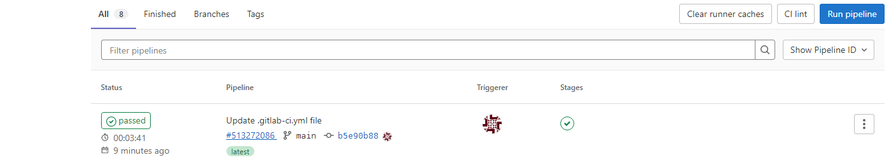
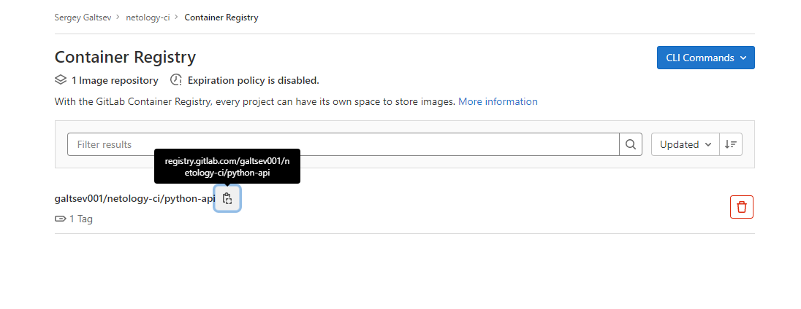
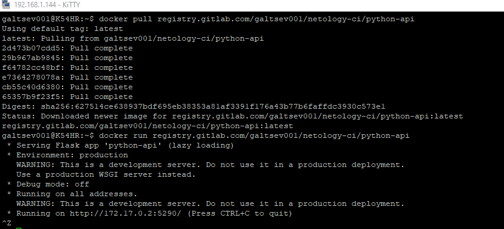

# Домашнее задание к занятию "09.06 Gitlab"

## Подготовка к выполнению

1. Необходимо [зарегистрироваться](https://about.gitlab.com/free-trial/)
2. Создайте свой новый проект
3. Создайте новый репозиторий в gitlab, наполните его [файлами](./repository)
4. Проект должен быть публичным, остальные настройки по желанию

## Основная часть

### DevOps

В репозитории содержится код проекта на python. Проект - RESTful API сервис. Ваша задача автоматизировать сборку образа с выполнением python-скрипта:
1. Образ собирается на основе [centos:7](https://hub.docker.com/_/centos?tab=tags&page=1&ordering=last_updated)
2. Python версии не ниже 3.7
3. Установлены зависимости: `flask` `flask-jsonpify` `flask-restful`
4. Создана директория `/python_api`
5. Скрипт из репозитория размещён в /python_api
6. Точка вызова: запуск скрипта
7. Если сборка происходит на ветке `main`: Образ должен пушится в docker registry вашего gitlab `python-api:latest`, иначе этот шаг нужно пропустить

### Product Owner

Вашему проекту нужна бизнесовая доработка: необходимо поменять JSON ответа на вызов метода GET `/rest/api/get_info`, необходимо создать Issue в котором указать:
1. Какой метод необходимо исправить
2. Текст с `{ "message": "Already started" }` на `{ "message": "Running"}`
3. Issue поставить label: feature

### Developer

Вам пришел новый Issue на доработку, вам необходимо:
1. Создать отдельную ветку, связанную с этим issue
2. Внести изменения по тексту из задания
3. Подготовить Merge Requst, влить необходимые изменения в `main`, проверить, что сборка прошла успешно


### Tester

Разработчики выполнили новый Issue, необходимо проверить валидность изменений:
1. Поднять докер-контейнер с образом `python-api:latest` и проверить возврат метода на корректность
2. Закрыть Issue с комментарием об успешности прохождения, указав желаемый результат и фактически достигнутый

## Итог

___

**Ответ**

Общая ссылка на GitLab => [link](https://gitlab.com/galtsev001/netology-ci)

### DevOps

+ Создаем файл `.gitlab-ci.yml`

```yaml
#Commmon parameters
image: docker:latest
services:
  - docker:dind

stages:         
  - build
  - deploy

#Build process
build-job:
    stage: build
    script:
      - docker login -u "$CI_REGISTRY_USER" -p "$CI_REGISTRY_PASSWORD" $CI_REGISTRY
      - docker build -t $CI_REGISTRY/galtsev001/netology-ci/python-api:latest .
    except:
        - main

#Deploy process
deploy-job:
  stage: deploy
  script:
      - docker login -u "$CI_REGISTRY_USER" -p "$CI_REGISTRY_PASSWORD" $CI_REGISTRY
      - docker build -t $CI_REGISTRY/galtsev001/netology-ci/python-api:latest .
      - docker push $CI_REGISTRY/galtsev001/netology-ci/python-api:latest
  only: 
    - main

```

+ Заливаем все файлы в GitLab и смотрим результат работы 

1) `Pipline` - отчет по работе 

    

2) Проверяем наличие образа в реестре образов системы GitLab

   

3) Пробуем получить локально наш образ и запустить

   


